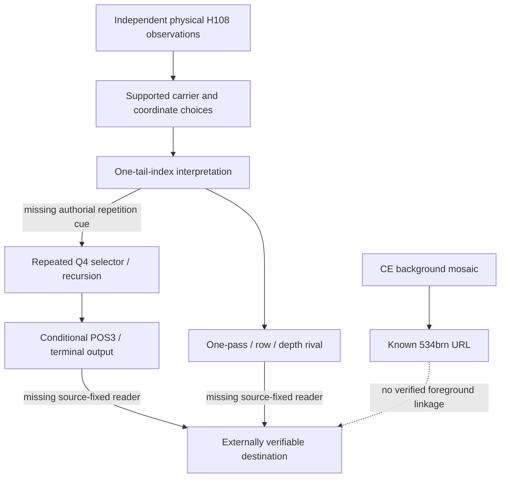

# Exploiting the INSIDE Experiment Map as a Research Instrument

*8 October 2026 · methodological synthesis grounded in the current main evidence map, the curated 34-record register, Experiment 458, and destination/source audits. This is an analytical agenda, **not** an additional decoded result or numbered sticker experiment.*

## The focus question changes what the map can tell us

The present [concept map](experiment-concept-map.md) and [hypothesis-test matrix](hypothesis-test-coverage-matrix.md) are useful inventories. But they answer several questions simultaneously: *what has been seen? how can it be represented? what decoder fits? what would follow?* In Novak and Cañas's concept-mapping method, every map should answer an explicit **focus question**, and **labeled cross-links** between subdomains are particularly fruitful. The problem-structuring literature additionally recommends examining the links among problems, goals and actionable choices, not merely clustering similar terms.

For future research use **three synchronized but separately queried maps**:

1. **What follows from physical/historical evidence without choosing a decoder?** Evidence + provenance → carrier constraints, layout, source-native affordances, exact bounded negatives.
2. **Which *additional assumptions* are indispensable for each plausible decoding operation?** Grammar → required parameters → historical licensing → alternative model → falsifier.
3. **What complete path from the CE object to a verifiable destination could exist?** Destination/consumer → expected typed input → prescribed transform → source artifact → sticker encoding. Build this last map **backwards**, to avoid choosing the consumer because an invented output looks interesting.

This separation is the concrete lesson from the [Novak/Cañas framework](https://cmap.ihmc.us/docs/theory-of-concept-maps.php), its [focus-question guidance](https://cmap.ihmc.us/docs/focusquestion.php), and [3ie's evidence-gap approach](https://3ieimpact.org/evidence-hub/evidence-gap-maps). They are methodological analogies, not certification of a formal systematic review.

## Finding A: two different missing bridges are masquerading as one gap

**Gap 1, operation identity:** One-slash-per-A–I tail and a single index/depth reading have some observed/historical motivation. The decision to **reuse** that selector on a second address coordinate, iterate the operation, and consume a terminal `100` has much less independent source support. Conditional formal uniqueness tests do not close this motivation gap. One contemporaneous source saying to apply a selector twice could matter more than a thousand further internal recursion theorems.

**Gap 2, endgame interpretation:** No candidate output has a source-fixed **consumer or independent recognition criterion**. This does **not** require a surviving interactive website: a verifiable image, precise printed instruction, stable external referent, or original-game event may suffice. But a pretty intermediate bitmap or coincidental English word is not the missing bridge by itself.

**Implication:** A complete research pathway must close its own path-specific operation gap *and* its endgame check. The recurrence assumption is necessary only for **recursive candidates**. Do not falsely impose it on standalone or one-pass routes.

## Finding B: research density concentrates on what is easy to compute, not what is decisive

The [current 34 claim-level register](../data/sticker-evidence-register.csv) contains **25 dependency-cluster labels**, not 34 independent studies. Fifteen rows are labeled `same-corpus` and five `same-corpus-selected`; only three rows have an `independent-physical` or `new-physical` independence label. These are descriptive metadata, not a significance calculation: other rows may include authentic historical evidence of different kinds.

The hypothesis-by-test matrix shows good supply of *bounded fits and exact negative controls*, some same-corpus heldout calculations, and a shortage of independently registered consumers or observed final outcomes. This is **study-design imbalance**, not prima facie support that the best-tested theory is likely right.

Avoid ranking mechanism families by experiment count. Instead list (a) how many distinct physical observations exist, (b) how many hypothesis-selection episodes used those observations, and (c) which independent event would actually alter a theory. Use dependency clusters as **warnings** and do not mistake 25 cluster labels for 25 statistically independent replications; distinct clusters can also depend on common data.

## Finding C: invert the matrix to reveal source-to-sticker “missing joins”

The present matrix is **mechanism × test design**. A second, orthogonal matrix should be **original artifact × native input affordance**, then compare each possible join to sticker output *without changing either side*. That is a constrained join problem, not an invitation to brute-force strings.

| Candidate pre-existing artifact | What is source-native and verified | Missing join to foreground | High-information, externally fixed next cue |
|---|---|---|---|
| CE background's `dat/534brn9653f9j8mmd` | Nine A–I tile mosaic provides actual route into the ARG; the damaged-page source is real | No independent foreground index/key, operation, byte registration or intact-image consumer | Pre-corruption original, source-explicit reference to slash/dash/dot or nine-by-three/nine-A–I reading |
| Archived Terminal41 status/shutdown pages | Four known print schemes, and 72/72 mirrored *small text* pages audited without actual form/POST handler | No confirmed surviving sticker-input endpoint; **printed 22 underscores are not an HTML form** | Older client-server capture, original endpoint code, or actual input/action grammar |
| `saf_dat_col` seven-field ASCII island | Preserved source has a real 22-character field adjacent to other plus-separated fields | Field role unknown; direct unsigned binary 108-bit sticker → literal 22-character Base36 number fails (token needs 111 bits) | Source-defined keyed operation/field semantics; do not invent raw Base36 registration |
| Reversible CE cover | Existing acorn/planet/diagnostic artwork and other monitor references | No sticker-to-monitor source-fixed transform or parameter | Independent cover/source transform repeated across different panels, measured against negative controls |
| Original 2016 game `SecretMap` | Historical witnesses name the asset; an orb-registration test protocol exists | **Original native bytes not recovered**; 14 known orbs may already explain any image marks | Native texture+scene transform, preregistered registration and independently unexplained marks |
| Original three-way secret joystick | Known bunker input and archived cut-console discussion | Literal sticker-to-known-password registration rejected under tested cyclic mappings | Distinct native command handler or exact newly cued input order |
| Standalone instruction, creator signature, production clue | Such an outcome requires no defunct network interface | No independent reading convention or specific exact recognition target | Author-provided rule, checkable referent, or independent predicted phrase/coordinate |

Source audits: [destination-first investigation](sticker-endgame-destination-investigation-2026-10-08.md), [Terminal41 and cover follow-up](sticker-endgame-followup-cover-jpeg-terminal41-2026-10-08.md), [SAF field correction](sticker-endgame-saf-dat-seven-field-audit-2026-10-08.md), [original game asset consumer audit](original-game-asset-consumer-audit-2026-10-08.md), [SecretMap source-bound null protocol](secretmap-original-asset-null-protocol-2026-10-08.md).

**Important:** failure to find a native 108-slot interface does not make an arbitrary 108-bit sticker key impossible. The foreground could produce a compact transformed key, an image or an instruction. What matters is finding a *specific externally licensed mapping*, with the source fixed **before** judging candidate outputs.

## Finding D: “most valuable observation” depends on the exact question

Experiment [458](experiment-458-common-mask-prospective-discrimination.md) compared **seven dependent model projections on the same 42 unknown residues** and exposed two distinct useful tests:

- **Rival discriminator:** residue **93** opposes the native-depth and frozen row-one-exception families (both dot) against the relabelled quarter family (slash). Among the structurally motivated competing families, a *single* fresh physical 93 is particularly useful. Residues **50/54** separately oppose depth versus quarter; residue **102** opposes quarter versus row. These are conditional **falsifiers**, not probabilities, and resolution 93 cannot independently choose depth *versus* row.
- **Shared-grammar validation:** residue **94** is a clean tail one-slash-stack prediction from existing physical 85=dot and 103=dot, but many candidate families agree. It checks a shared premise more directly than it distinguishes surviving interpretations. Its *validation value* is conceptually different from 93's *discrimination value*.

Do not collapse these two values into one “priority score”. Information-gain work on scientific model discrimination emphasizes selecting measurements for their ability to separate plausible models while respecting correlated evidence; without warranted priors, a **partition of possible outcomes** is preferable to a fake numerical expected value. See [Pham & Tsai (2023)](https://doi.org/10.1016/j.advwatres.2023.104485) and [Entropy-based experimental design (2016)](https://www.mdpi.com/1099-4300/18/11/409).

## Finding E: failures and absences should be typed, not turned into vague red dots

Current matrix cells “none”, “not mapped”, “negative” and “compatible” have dramatically different meanings. A more useful *gap typology* is:

| Relation status | Meaning | Specific INSIDE example | Action |
|---|---|---|---|
| **Unmapped** | The curated pilot did not read the underlying test | Most of the 443 numbered reports aren't individually in 34 cards | Targeted report audit |
| **No source recovered** | Exact native bytes/earlier state absent | `SecretMap` original texture missing | Provenance acquisition, not cipher search |
| **Compatible but underidentified** | Model fits but the same data fit alternatives | One-slash tail; depth vs quarter survivors | Frozen cross-family comparison |
| **Positive native link** | Exact external artifact/operation actually anchored | CE background → `534brn` route | Use as an anchor without assuming foreground shares it |
| **Bounded falsification** | Specific fully defined candidate rejected | Frozen E2 predicts 103 slash, observed 427 dot | Preserve minimal counterexample |
| **Unregistered jump** | Plausible operation requires extra arbitrary parameters | Cover XOR, arbitrary pigpen alphabet, repeat selector without cue | Obtain authorial parameter or stop |
| **Validated endgame** | Reproducible source-fixed chain reaches checkable answer/action | **No row currently qualifies** | Define success criterion before searching |

This typology prevents the common mistakes that (i) many untested variants imply an evidence gap worth spending resources on; (ii) an absent archived HTML form disproves every historically live backend; and (iii) the failure of one exact version refutes the whole mechanism family.

## Finding F: test the map as a logical model, not only as a picture

**Typed propositions.** Give an edge a full grammatical meaning, e.g. `physical Q4 slash position --defines (under one-slash assumption)--> depth S(j)`; `depth S(j) --is used twice by--> recursive consumer [hypothesized, source cue missing]`; `E2 --predicts--> residue 103 slash [frozen]`; `new sticker 427 --observes--> residue 103 dot [physical]`. No generic “related to” edge when the relationship is a testable claim.

**Backwards chaining and minimal unsatisfied prerequisites.** Starting at an alleged endpoint, walk back to physical observations. Mark each edge's *license*, model-selected conditions and cheapest falsifier. Identify the smallest set of missing prerequisites preventing an end-to-end check. The 534brn route has a real physical background-to-URL edge but lacks any grounded foreground-to-operation edge. The recursive route needs a repeated-selector cue as well.

**Cross-consistency / morphological space.** Enumerate compatible combinations only across separate axes: carrier representation × decoder operation × artifact/consumer × chronology/source vintage × validation mode. Record exactly why pairs are impossible, unsupported or licensed. Do not evaluate every Cartesian combination visually. This adapts the [Ritchey morphological cross-consistency method](https://doi.org/10.1057/palgrave.jors.2602177) to our puzzle and naturally yields new falsifiers.

**Time-of-availability.** The 2016 game, 2016–19 ARG terminal/shutdown, late-2019 CE, and 2020 macOS continuation occupy different periods. Keep explicit `known_by`, `potentially_live_from` and `derived_from` edges. A reference to already-solved 2016 material may be recap, not a new input; a claimed 2019 CE instruction requiring an artifact first released in June 2020 needs independent evidence of planned cross-release continuity. Publication time alone cannot prove intent, but it can rule out some claimed historical discovery chains.

**Minimal unsatisfiable cores.** Where a candidate fails, preserve the smallest conflict set: `E2 predicts r103=/` + `owner observes r103=.` suffices to reject that frozen E2 pair. Separately preserve assumptions needed for Pigpen/direct Morse/lever bounded failures, so later source cues reopen only precise changed hypotheses.

**Graph structure caution.** Do **not** compute scientific betweenness/centrality or lexical community detection on the current 34-record matrix yet. These rows are curated claims, and edges between them are only partially specified. Apparent hubs would mostly reflect our choice of labels and report coverage rather than independent evidentiary leverage. First extract a typed source–premise–operation–consumer graph; then compute bridge/cut sets, provenance-aware paths and missing edges.

## Three priority decisions from the map

**Priority 1: source-native backwards map.** Build a narrow, auditable registry of *actual* consumer affordances and exact unknown joins. Native `SecretMap`/existing game consumers and `534brn`/Terminal41 are plausible places to look because they already exist as named artifacts; none is currently a decoded endpoint.

**Priority 2: authorial rule recovery.** Look for **specific** historical evidence that tells a solver to apply the tail index once, twice, with a quarter/depth relabel, or to an external named surface. This is the model-identity bottleneck; further internal compactness theorems will not repair an absent premise.

**Priority 3: maintain a pre-frozen discriminating/validation split.** Keep r93/r50/r54/r102 (rival separation) distinct from r94 (shared grammar validation), and keep r82 (U4/U5 fork) under its historically frozen rule. Recompute no past prediction after a new sticker without a versioned *post-observation* audit.

These are **decision priorities**, not a mandate for owner outreach, indiscriminate missing-sticker search or an arbitrary new cipher sweep.

## Methodological references

- Novak and Cañas: [Theory underlying concept maps](https://cmap.ihmc.us/docs/theory-of-concept-maps.php), [Focus question](https://cmap.ihmc.us/docs/focusquestion.php).
- Colin Eden: [Analyzing cognitive maps to structure complex issues](https://doi.org/10.1016/S0377-2217(03)00431-4), with focus on action-relevant map structure.
- Campbell Collaboration: [Evidence and gap map guidance](https://pmc.ncbi.nlm.nih.gov/articles/PMC8356343/); 3ie: [Evidence gap maps](https://3ieimpact.org/evidence-hub/evidence-gap-maps). A 34-card curated internal index is **not** a formally systematic EGM.
- Ritchey: [Morphological analysis and cross-consistency](https://doi.org/10.1057/palgrave.jors.2602177).
- Model-discrimination design: [Pham and Tsai (2023)](https://doi.org/10.1016/j.advwatres.2023.104485), [Entropy-based experimental design (2016)](https://www.mdpi.com/1099-4300/18/11/409).

**Stopping principle:** Promote a link only when its native source supplies an operation, its parameters are fixed before reading outputs, and its predicted consequence survives a meaningful control. A shorter cross-linked chain with one authentic source constraint is worth more than a larger graph of mathematically compatible transformations.
