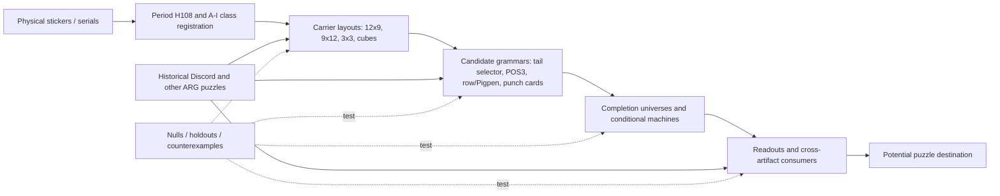

# Experiment Concept Map and Coverage Matrix

_Last indexed main-branch ledger: 423. Snapshot: 2026-10-08. Open-PR claims are **provisional and unmerged**, not silently treated as main-branch results._

## Purpose and reading rules

This is a navigational **map of tests actually recorded**, not a cumulative proof, a claim that every numbered experiment is independent, or a substitute for their full reports. Source of truth for 1–423 is [the canonical ledger](experiment-ledger.md); detailed experiments 298+ generally have individual `docs/experiment-*.md` reports, while earlier full prose lives in the archived Results/Diary. The rows below preserve *every indexed experiment title*, allowing keyword search and reassignment. A multi-tag row crosses conceptual boundaries; the first tag is **not** necessarily its principal inference.

Evidence layers: **O** physical observation; **H** historically attested operation; **M** model-dependent derivation; **N** negative control/null; **P** prospective/out-of-sample prediction; **S** semantic or endgame speculation. Being mathematically exact does not promote M to O. Re-using the same corpus, selecting a model post hoc, or running a simulation conditioned on that model does not constitute independent replication.

## Conceptual pipeline

**Important non-implications:** an aesthetically ordered image is not a decoded payload; a valid finite machine is not evidence of the author's intended decoder; compatibility is not predictive success; a 3D coordinate arrangement is not evidence of a physical cube; endpoint numerology is not proof of the production print count.

## Concept-level matrix

| Branch | Typical experiments | What has actually been learned | Remaining discriminator | Evidence status |
|---|---|---|---|---|
| Physical collection, H108 repeat, serial phase | 1–10, 297, 301, 315, 418, 420–422 | 108-period and A–I periodic address supported by physical repeats and historical records; same-residue duplicates agree | Newly observed unknown residues and independent original photographs | O/H, strong carrier; no payload |
| Background A–I mosaic and boundary registration | 9, 78–90, 173–190, 302, 319, 325, 333, 344–346 | Background assembly and foreground indexing have distinct coordinate domains; usable full-perimeter photos now exist | Replicated independent pixel cues fixing body masks/orientation | O/H, masked bridge unresolved |
| Serial ordering, shifts, scrambled 2D pictures | 10, 14, 71, 298, 326, 345, 347, 360–364 | Broad row/column reordering and visual continuity can fail strict nulls or be unrecoverable even on acorn positive control | External clue specifying score/operation/order | Mostly N; no uniquely decoded image |
| Geometric alphabets, 3×3 and cube representations | 13, 17–18, 63, 66, 326–335, 350–352, 373 | Many coordinate descriptions are formally valid; literal dual-stroke Pigpen rejected; flexible categorical Pigpen underidentified | Specific glyph codebook/transform plus blind physical holdout | M/N; cube tests in open PRs |
| Q4 9+3 / one-slash tail as independent operation | 19, 22, 51–56, 69–70, 317–318, 329–340, 373–376 | One-slash per class consistent with observations; row and column interpretations not equally supported under post-hoc one-exception refinement; selection bias audited | Frozen residues 84, 102, 93; new independent consumer | Mixed O/M/N/P, no plaintext |
| Primary POS3 / 3-of-9 and native ternary coding | 23–48, 55–60, 96–114, 206–210, 232–263, 271–283, 348–352 | Compact constraints and exact enumerations describe a highly structured candidate family; some constraints depend on model selection | Independently specified observation-only operation and withheld results | Principally M, calibration necessary |
| Recursive finite transducer, routing, terminal 100 | 90–148, 151–172, 194–296, 303–314, 320–323, 353–359 | Exact internal coherence and formal normal forms; extensive operation-gauge equivalences; recursion/route preservation often supplied as a criterion | Independently derived G6/G7 consumer and out-of-family prediction | Strong conditional M; not authorial proof |
| Hidden completions, gauge and false certainty | 29, 47, 72, 91–92, 158–172, 194–195, 220–240, 280–289, 365–367, 393–395, 407, 418 | Numerous inequivalent raw/master/state universes coexist; preferred 14-state ensemble is conditional; physical observations can prune it | Versioned full-universe comparison and pre-registered predictions | M/N/P; never fill unknowns as observed |
| Braille / Trifid / Morse / direct text | 11, 13, 20, 57–65, 87, 112, 122, 236, 327–335, 368–372, 394, 402–406 | Literal cheap registrations often fail exact tests; language scoring is especially susceptible to multiple comparisons | Independent alignment, legend or known consumer | Mostly N; generic fishing closed |
| Other puzzles as operation precedents | 21, 61, 68, 89, 94, 113, 148, 297–302, 315–316, 338, 342–343, 351, 361–364, 368–389, 401, 408–417 | Acorn ordering/Life, Xbox Braille, 534brn, lever and cover supply *classes* of operations, not arbitrary copied parameters | Exact, historically grounded registration from one artifact to the stickers | H with bounded M/N |
| External object 534brn and numeric consumers | 316, 337, 378–391, 397–399, 408, 413–417, 423 | A conditional external state can select rival early-stage completions; 427-dot later falsified an externally selected pair | Source-proven registration, nondamaged source bytes, fresh holdouts | H/M/P; avoid hindsight |
| Overlay, XOR, spatial mask and punch-card | 25–27, 71, 78, 319, 325, 338, 396, 409–412, 419; PR #140 | Representational transforms often preserve uncertainty instead of revealing a decoder | Sticker-specific overlay alignment, independent bit/scan reader | N/M; no decoded output |
| Production/master printing and total count | 19, 68, 76, 173–190, 301; PR #141 | Manufacturer/serial hypotheses bounded; number arithmetic is not evidence of a print endpoint | Verified print-run facts, highest serial, manufacturing layout | H/S |
| Semantic destinations, gameplay inputs and physical action | 3, 21, 57–68, 94, 113–122, 139, 148, 240, 324, 338, 342–343, 378–389, 401, 408–415; PR #144 | Consumer forms remain plural: instructions, overlays, state, coordinates, game input, external URL | Independent source artifact cue and exact reproducible consumer | Exploratory S; no final solution |

## Dependency traps and negative-result landmarks

1. **Carrier does not imply decoder.** H108, nine classes, 81/27 boundary and 3×3 organization predate most elaborate machine hypotheses.
2. **Selection-on-the-answer trap.** Experiments 329–340 show why 330's 4/4 correct leave-one-out results were logically guaranteed after model selection. Preserve frozen prospective predictions, not retrospective p-values.
3. **Machine tautology trap.** Experiments 286–296 and 303–314 distinguish operation-gauge classes and show that terminal-100 agreement alone can survive many noncanonical rules. Read Experiment 286 explicitly as **invalid/superseded**.
4. **Cross-artifact postselection trap.** 378–391 and 418 show that an intriguing 534brn readout can be parameter-sensitive and physically falsified. Follow the chronological evidence, not the prettiest transform.
5. **Image objective mismatch.** 298, 345, 347, 360–364 and 419 warn that continuity, row order and XOR can be computed perfectly without producing a recoverable image or message.
6. **Numerology trap.** 301 and PR #141 distinguish structural divisibility from independent evidence for total sticker count.
7. **Lossy source trap.** 316, 337, 413–417 and 423 keep damaged JPEG capture bytes, inferred dimensions and semantic footer claims apart.

## Open PR overlay (not yet canonical)

| PR | Experimental scope | Relationship to map | Handling |
|---|---|---|---|
| [#140](https://github.com/gamesbyian/GRA-EDISNI/pull/140) | 424, IBM 029 punch-card transform | Alternative symbol carrier; lossless but information-neutral | Pending, do not elevate to decoded content |
| [#141](https://github.com/gamesbyian/GRA-EDISNI/pull/141) | 426, 23-aware print endpoints | Production/endpoints; 621 arithmetic and 648 H108 alignment | Pending; arithmetic alone insufficient |
| [#142](https://github.com/gamesbyian/GRA-EDISNI/pull/142) | 448–449, cube-depth observation null/read | 3D coordinate families, Q4 selection | Pending; compatible ≠ distinctive |
| [#143](https://github.com/gamesbyian/GRA-EDISNI/pull/143) | 450–456, completion ensembles and competing Cube 4 instructions | Exact 233,280/324/12 master filtering; cross-cube mask/null/holdout; opposite predictions at residues 50/54/93 | Pending; conditional grammars and nonunique outputs |
| [#144](https://github.com/gamesbyian/GRA-EDISNI/pull/144) | Destination-first hypotheses and carrier/channel control | Endgame layer independent of “must yield bitmap/text” prior | Pending; portfolio, not decoded endpoint |

Numbering **425, 427–447 is not accounted for by this main ledger plus these five open PR summaries**. Do not assume those IDs were never used: inspect historical/closed PRs, archived docs and unmerged branches before allocating IDs. PR #143 explicitly reports renumbering to avoid collisions. The current map intentionally does not declare the numbering contiguous.

## Experiment stages

| Stage | IDs | Focus | Caution |
|---|---|---|---|
| I | 1–72 | Basic symbol/period/shape and emerging selector grammars | Broad exploration, substantial retrospective freedom |
| II | 73–148 | Registration, nested selection and routing | Exact descriptions of incumbent family |
| III | 149–240 | Formal models, inverse generators, proof and provenance | Same-premise deduction is not new observation |
| IV | 241–296 | Raw reconstruction, alternatives, gauges, closures | Some assumptions closed under selected semantics |
| V | 297–314 | Historical recovery, global/local transform hostile audits | Gauge multiplicity and model selection |
| VI | 315–359 | Epistemic reset, historical operation checks, Pigpen/row rivals | Historical licenses operation *types* |
| VII | 360–406 | Row-order positive controls, cross-artifact/weighted ensembles | Negative controls and nonunique readouts |
| VIII | 407–423 | 534brn, external visuals, new physical data, XOR/JPEG | Physical evidence can overturn conditional rivals |

## How to add the next experiment

Assign an immutable ID only after checking the main ledger **and all open/closed PR collisions**. Record: question; input snapshot and known/unknown mask; hypothesis family and operation specified *before* output; exact search space and parameters; nulls/holdouts; outcome including negative results; independent versus reused evidence; conditional alternatives; frozen predictions; files/script/report; whether it changes the conceptual matrix. Link the new row in the ledger. Do not report derived completion labels as physically seen.

## Exhaustive experiment-title crosswalk

The following index covers **every ID present in the main-branch ledger**, including numbering gaps; tags are heuristic navigation aids and may overlap. The original ledger title, not any tag, is authoritative.

| ID | Era | Concept tags | Canonical ledger title |
|---:|---|---|---|
| 1 | I: early exploratory/structural | GEOMETRY, CODING | symbol dependence on the nine image classes |
| 2 | I: early exploratory/structural | ARG | raw nine-sticker block coverage |
| 3 | I: early exploratory/structural | ARG | 14-state secret-ending lever sequence |
| 4 | I: early exploratory/structural | GEOMETRY | direct alignment with the iOS 600-cell bitmap |
| 5 | I: early exploratory/structural | CARRIER | motivated repeat periods |
| 6 | I: early exploratory/structural | CARRIER | nine-block repeat periods |
| 7 | I: early exploratory/structural | CARRIER, UNIVERSE | chronological quasi-holdout test of H108 |
| 8 | I: early exploratory/structural | CARRIER | structure inside the H108 cycle |
| 9 | I: early exploratory/structural | GEOMETRY, ARG | exact nine-tile geometry recovered |
| 10 | I: early exploratory/structural | CARRIER | H108 reshape and cross-artifact structure |
| 11 | I: early exploratory/structural | CARRIER, ENDGAME | direct H108 plaintext hypotheses pruned |
| 12 | I: early exploratory/structural | CARRIER, GEOMETRY, UNIVERSE | H108 under image-class-stratified nulls |
| 13 | I: early exploratory/structural | CARRIER, GEOMETRY, CODING | direct Braille on the 9×12 H108 reshape |
| 14 | I: early exploratory/structural | GEOMETRY | improved masking/inpainting and non-3×3 geometry search |
| 15 | I: early exploratory/structural | MACHINE | transformed-quarter and repeated-glyph structure |
| 16 | I: early exploratory/structural | CARRIER, UNIVERSE | broader H108 structural discriminators |
| 17 | I: early exploratory/structural | CARRIER, GEOMETRY, CODING | H108 binary-zone significance and 4×27 transpose |
| 18 | I: early exploratory/structural | GEOMETRY, UNIVERSE | 3×3×3 quarter cubes and factorization discrimination |
| 19 | I: early exploratory/structural | SELECTOR, ENDGAME | production-master-sheet hypothesis and Q4 control-bit follow-up |
| 20 | I: early exploratory/structural | ENDGAME | twelve-character plaintext candidate sweep |
| 21 | I: early exploratory/structural | OTHER / review | INSIDE puzzle-technique inventory |
| 22 | I: early exploratory/structural | SELECTOR, UNIVERSE | Q4 selector coupling falsification and completion-space diagnostics |
| 23 | I: early exploratory/structural | GEOMETRY, CODING, SELECTOR | fixed axis-swap identity between Q2/Q3 and Q4 one-hot maps |
| 24 | I: early exploratory/structural | SELECTOR | independent low-description-length 9+3 and 9×9 structural checks |
| 25 | I: early exploratory/structural | CODING, UNIVERSE | blind low-rank binary completion check |
| 26 | I: early exploratory/structural | SELECTOR, MACHINE | transformed 3+3+3 control family and one-dimensional master-template rejection |
| 27 | I: early exploratory/structural | OTHER / review | whole-object symmetry and 4×3 macroblock-copy screen |
| 28 | I: early exploratory/structural | OTHER / review | exact frame-boundary alignment of the dash/dot vocabulary split |
| 29 | I: early exploratory/structural | SELECTOR, UNIVERSE, ARG | compatibility versus actual erasure recovery in the 9+3 control family |
| 30 | I: early exploratory/structural | CODING, UNIVERSE | robustness audit of the two frozen one-hot predictors |
| 31 | I: early exploratory/structural | SELECTOR | symmetric three-input Q4 control family and Q4 separability |
| 32 | I: early exploratory/structural | UNIVERSE | minimum-rank refinement with compact certificate |
| 33 | I: early exploratory/structural | OTHER / review | exact calibration and local-deduction anatomy of the frames-4–9 rule |
| 34 | I: early exploratory/structural | GEOMETRY, MACHINE | native 4×3×3×3 automorphism and coordinate-redundancy screen |
| 35 | I: early exploratory/structural | OTHER / review | additive coordinate-generator rejection |
| 36 | I: early exploratory/structural | ENDGAME | local frame recurrence and production-causality refresh |
| 37 | I: early exploratory/structural | CODING | broader line-one-hot architecture across the 81/27 boundary |
| 38 | I: early exploratory/structural | CARRIER, CODING, UNIVERSE | corrected chronology quasi-holdout for the broader primary one-hot model |
| 39 | I: early exploratory/structural | CARRIER, UNIVERSE | serial-order simplification and leave-one-out reconstruction strength |
| 40 | I: early exploratory/structural | GEOMETRY, CODING, ARG | polarity-order mask and recovery of the stalled branch |
| 41 | I: early exploratory/structural | OTHER / review | joint multiplicity calibration and Git-history correction natural experiment |
| 42 | I: early exploratory/structural | SELECTOR | Q4 branch incompatibility and primary-code internal checks |
| 43 | I: early exploratory/structural | SELECTOR | monotone-frontier abstraction and Q4 model incompatibility |
| 44 | I: early exploratory/structural | MACHINE | affine-line multiplicity correction and preregistered base-27 payload shape |
| 45 | I: early exploratory/structural | UNIVERSE | prospective information ranking and completion-independent primary relations |
| 46 | I: early exploratory/structural | CODING, MACHINE | native ternary-tensor transform test and hostile false-positive audit |
| 47 | I: early exploratory/structural | SELECTOR, UNIVERSE | disentangling model selection, completion entropy, and falsification value |
| 48 | I: early exploratory/structural | CODING, ENDGAME | fixed human-solvable generator on the three-trit frame words |
| 49 | I: early exploratory/structural | OTHER / review | label-free equality signatures and an adjacency false jewel |
| 50 | I: early exploratory/structural | CODING, ENDGAME | proof that primary polarity is not a local function of ternary payload |
| 51 | I: early exploratory/structural | SELECTOR, UNIVERSE | Q4 factorization and minimal discrimination protocols |
| 52 | I: early exploratory/structural | OTHER / review | information-theoretically optimal primary master identification |
| 53 | I: early exploratory/structural | GEOMETRY, CODING, SELECTOR | reconciliation of Q4 row-one-hot bookkeeping with the Experiment 44 multiplicity correction |
| 54 | I: early exploratory/structural | GEOMETRY, MACHINE | T-specific axis separability and transform-pair hostile checks |
| 55 | I: early exploratory/structural | OTHER / review | exact Boolean constraint basis for the 18 surviving primary masters |
| 56 | I: early exploratory/structural | CODING, SELECTOR | ternary Q4 checksum after one-hot normalization |
| 57 | I: early exploratory/structural | OTHER / review | base-27 payload as an address rather than a character |
| 58 | I: early exploratory/structural | CODING, UNIVERSE | polarity-level leave-one-out reconstruction |
| 59 | I: early exploratory/structural | ENDGAME | intended-human-path audit of the base-27 address representation and preregistered semantic lock |
| 60 | I: early exploratory/structural | SELECTOR, UNIVERSE | completing the quarter↔Q4 comparison and exact inverse-map impossibility |
| 61 | I: early exploratory/structural | CODING, ARG | refreshed INSIDE/ARG technique inventory after the one-hot discovery |
| 62 | I: early exploratory/structural | CODING | Trifid and Fractionated-Morse audit |
| 63 | I: early exploratory/structural | GEOMETRY | standard finite-geometry / orthogonal-array audit |
| 64 | I: early exploratory/structural | CODING | implementation-style prior and ternary de Bruijn universal-cycle test |
| 65 | I: early exploratory/structural | ENDGAME | geolocation output-shape audit |
| 66 | I: early exploratory/structural | GEOMETRY, SELECTOR, ARG | 3D pointer geometry and direct secret-ending lever reuse |
| 67 | I: early exploratory/structural | CARRIER, SELECTOR, ARG | pointer-target observability audit |
| 68 | I: early exploratory/structural | OTHER / review | contemporaneous Collector's Edition language / clue-signalling audit |
| 69 | I: early exploratory/structural | CODING | standard one-hot/one-cold and thermometer-code synthesis |
| 70 | I: early exploratory/structural | CODING, SELECTOR, MACHINE | Q4 depth-stack selector as a recursive one-hot normalizer |
| 71 | I: early exploratory/structural | GEOMETRY, UNIVERSE | hierarchical placement and erasure-tolerant image architecture |
| 72 | I: early exploratory/structural | UNIVERSE, ARG | exact erasure recoverability under the current structural families |
| 73 | II: registration/routing | SELECTOR | formal hierarchical-address model and cycle-index audit |
| 74 | II: registration/routing | GEOMETRY, MACHINE | axis-sibling audit and ordered two-stage recursion |
| 75 | II: registration/routing | SELECTOR | pointer-to-selector-surface cross-check |
| 76 | II: registration/routing | CARRIER, ARG, ENDGAME | physical-copy redundancy and recovery curve under provisional endpoint 603 |
| 77 | II: registration/routing | ARG, ENDGAME | human-visible structural rediscovery |
| 78 | II: registration/routing | GEOMETRY | registration / layer-combination hypothesis |
| 79 | II: registration/routing | GEOMETRY | diagonal calibration and 3D registration spine |
| 80 | II: registration/routing | GEOMETRY | calibrated-row edge registration |
| 81 | II: registration/routing | CARRIER, GEOMETRY | raw-corpus registration audit, chronology, and centre lane |
| 82 | II: registration/routing | GEOMETRY | full registration-row code |
| 83 | II: registration/routing | GEOMETRY | post-registration residual structure and Experiment 54 reinterpretation |
| 84 | II: registration/routing | GEOMETRY, SELECTOR | extracted 27-cell registration surface versus Q4 |
| 85 | II: registration/routing | CARRIER, GEOMETRY | closed-corpus operating shift |
| 86 | II: registration/routing | GEOMETRY, SELECTOR | joint registration-plus-Q4 conditional audit |
| 87 | II: registration/routing | GEOMETRY, CODING | post-registration Braille geometry |
| 88 | II: registration/routing | GEOMETRY, MACHINE | recursive registration self-similarity |
| 89 | II: registration/routing | CARRIER, GEOMETRY, MACHINE | pre-2021 chronology rewind of recursive registration |
| 90 | II: registration/routing | GEOMETRY, SELECTOR, MACHINE | canonical Q4 orientation and diagonal-selector simplification |
| 91 | II: registration/routing | OTHER / review | functional quotient of the 14 surviving masters |
| 92 | II: registration/routing | SELECTOR, MACHINE, UNIVERSE | exact Q4 arrangement null and downstream closures |
| 93 | II: registration/routing | GEOMETRY, SELECTOR | Q4 centre-column reverse-depth baseline |
| 94 | II: registration/routing | OTHER / review | MIS/MISS contextual-language audit |
| 95 | II: registration/routing | UNIVERSE | fresh-expert structural reconstruction |
| 96 | II: registration/routing | CARRIER, UNIVERSE | minimal generative specification and live-corpus reconstruction |
| 97 | II: registration/routing | SELECTOR | Q4 centre defects self-label the three functional states |
| 98 | II: registration/routing | UNIVERSE | hostile sibling/null audit of the single-defect state |
| 99 | II: registration/routing | OTHER / review | standard-object audit after the self-labelling result |
| 100 | II: registration/routing | CARRIER | chronology rewind of the self-labelling p state |
| 101 | II: registration/routing | GEOMETRY | local theorem for the 210 defect code and off-diagonal checks |
| 102 | II: registration/routing | GEOMETRY, MACHINE, UNIVERSE | arbiter isomorphism and off-diagonal ablation |
| 103 | II: registration/routing | CARRIER, GEOMETRY, MACHINE | arbiter sibling audit and physical geometry |
| 104 | II: registration/routing | MACHINE | terminal pass is exact canonicalization of the arbiter state |
| 105 | II: registration/routing | GEOMETRY, SELECTOR, MACHINE | arbiter sibling audit extension and depth-geometry alignment |
| 106 | II: registration/routing | CARRIER | chronology of frame-2 redundancy and frame-8 necessity |
| 107 | II: registration/routing | OTHER / review | macro-lattice X decomposition |
| 108 | II: registration/routing | GEOMETRY, MACHINE | edge-middle frames reduce to two local gates around the X |
| 109 | II: registration/routing | OTHER / review | compact paper-and-pencil normal form |
| 110 | II: registration/routing | CODING | polarity quotient and description-length correction |
| 111 | II: registration/routing | CODING | bounded native-line audit of the compact trit lattice |
| 112 | II: registration/routing | GEOMETRY, CODING | bounded Braille-polarity cue audit |
| 113 | II: registration/routing | ENDGAME | direct-visibility / intended-human-path audit |
| 114 | II: registration/routing | SELECTOR, ENDGAME | Q4 human-entry sibling audit |
| 115 | II: registration/routing | SELECTOR | reopening the frozen base-27 pointers as state queries |
| 116 | II: registration/routing | SELECTOR, MACHINE | terminal self-index and address-boundary audit |
| 117 | II: registration/routing | SELECTOR, UNIVERSE, ARG, ENDGAME | the two frozen pointer targets form a complete hidden-state readout |
| 118 | II: registration/routing | CODING, MACHINE | outer-shell thermometer and Q3 as the canonical routing shell |
| 119 | II: registration/routing | SELECTOR, MACHINE | 210 is the quarter-routing table for the frozen pointer requests |
| 120 | II: registration/routing | SELECTOR, MACHINE | hostile closure of direct pointer-bit decoding |
| 121 | II: registration/routing | GEOMETRY, SELECTOR, MACHINE | registration turns the frozen pointer into a loopless routing graph |
| 122 | II: registration/routing | GEOMETRY, MACHINE, ARG, ENDGAME | terminal raw codeword and bounded printer-image test |
| 123 | II: registration/routing | CARRIER, ENDGAME | generative core versus observer/readout layer |
| 124 | II: registration/routing | MACHINE, ENDGAME | the terminal signed bit has an internal routing consumer |
| 125 | II: registration/routing | SELECTOR, MACHINE | 210 uniquely selects permutation-valued regenerated surfaces |
| 126 | II: registration/routing | MACHINE | exact standard routing object in the outer shell |
| 127 | II: registration/routing | MACHINE | frozen downstream branch audit after the terminal-bit integration |
| 128 | II: registration/routing | CODING, MACHINE | the granted permutation regenerates the T thermometer code |
| 129 | II: registration/routing | MACHINE | intrinsic permutation-operation stop test |
| 130 | II: registration/routing | MACHINE, UNIVERSE | the 210 grant reconstructs Q3's complete routing table |
| 131 | II: registration/routing | CODING, MACHINE, UNIVERSE | the regenerated route table subsumes the thermometer reconstruction |
| 132 | II: registration/routing | UNIVERSE | Q3 completion integrates the old Q1/Q2 cycle pair |
| 133 | II: registration/routing | MACHINE | minimal finite-machine reformulation |
| 134 | II: registration/routing | MACHINE | terminal 100 is the derangement indicator of the granted route family |
| 135 | II: registration/routing | MACHINE | frame 6/9 becomes a complementary test of the terminal class |
| 136 | II: registration/routing | MACHINE | the permutation layer is a triangle-symmetry fragment, not yet the whole answer |
| 137 | II: registration/routing | MACHINE, ENDGAME | payload-level closure and present stopping point |
| 138 | II: registration/routing | GEOMETRY | the derangement test is a visible diagonal test |
| 139 | II: registration/routing | MACHINE, ENDGAME | endpoint synthesis and branch closure |
| 140 | II: registration/routing | GEOMETRY, ARG | historical diagonal grammar already existed, but at a different level |
| 141 | II: registration/routing | CARRIER, GEOMETRY, SELECTOR, MACHINE | selector reuse physically enforces the empty terminal diagonal |
| 142 | II: registration/routing | SELECTOR, MACHINE | canonicalization is selector aliasing / don't-care collapse |
| 143 | II: registration/routing | MACHINE | terminal 100 is itself a loopless function |
| 144 | II: registration/routing | OTHER / review | the causal and certificate views now coincide |
| 145 | II: registration/routing | ENDGAME | current strongest stopping point |
| 146 | II: registration/routing | GEOMETRY, MACHINE | the empty terminal diagonal is forced before recursive narrowing |
| 147 | II: registration/routing | MACHINE, UNIVERSE | Experiment 90's two conditions are exactly the completion of the loopless partial surface |
| 148 | II: registration/routing | MACHINE, ARG | targeted clue-language audit after structural closure |
| 149 | III: machine formalization | OTHER / review | research-opportunity consolidation and overlap audit |
| 150 | III: machine formalization | OTHER / review | dependency order and shared deliverables |
| 151 | III: machine formalization | MACHINE | Engine A formalization: the machine is a typed finite transducer, not yet a closed automaton |
| 152 | III: machine formalization | CARRIER, UNIVERSE | exact ranks, quotients, observer kernel and state erasure |
| 153 | III: machine formalization | SELECTOR, MACHINE | synchronization, reset status, idempotence and repeated-selector dynamics |
| 154 | III: machine formalization | MACHINE | transformation structure: what is generated, and what is not |
| 155 | III: machine formalization | MACHINE | exact symmetries, gauge, and automorphism discipline |
| 156 | III: machine formalization | OTHER / review | standard-object matches and the status of 100/110/111 |
| 157 | III: machine formalization | OTHER / review | hostile audit of Engine A |
| 158 | III: machine formalization | OTHER / review | Engine B parent-family construction |
| 159 | III: machine formalization | SELECTOR, UNIVERSE | exact selector-universe enumeration |
| 160 | III: machine formalization | MACHINE, UNIVERSE | route-table rarity and inverse reconstruction |
| 161 | III: machine formalization | MACHINE, UNIVERSE | defect-family enumeration and inverse terminal100 |
| 162 | III: machine formalization | GEOMETRY | MDL ledger and synthetic whole-fingerprint density |
| 163 | III: machine formalization | OTHER / review | cheapest alternatives and hallucination autopsy |
| 164 | III: machine formalization | OTHER / review | Engine B checkpoint |
| 165 | III: machine formalization | UNIVERSE | Engine C exact evidence reconstruction and witness atlas |
| 166 | III: machine formalization | CARRIER, UNIVERSE | single-observation deletion sensitivity and load-bearing residues |
| 167 | III: machine formalization | UNIVERSE | single- and double-mutation sensitivity |
| 168 | III: machine formalization | OTHER / review | missing-residue information atlas |
| 169 | III: machine formalization | UNIVERSE | architecture-discrimination versus state-information priority |
| 170 | III: machine formalization | UNIVERSE | erasure tolerance and blinded holdout reconstruction |
| 171 | III: machine formalization | CARRIER | chronology and the distinct roles of frames2 and8 |
| 172 | III: machine formalization | OTHER / review | dependency DAG and circularity audit |
| 173 | III: machine formalization | CARRIER, GEOMETRY | Engine D physical-image corpus inventory |
| 174 | III: machine formalization | OTHER / review | first repeated-residue visual spot check |
| 175 | III: machine formalization | MACHINE | Engine D measurement protocol and runtime gate |
| 176 | III: machine formalization | CARRIER | physical-corpus bias audit |
| 177 | III: machine formalization | OTHER / review | provenance audit of repeated-residue controls |
| 178 | III: machine formalization | ARG, ENDGAME | external-source recovery: authorship and manufacturing context |
| 179 | III: machine formalization | MACHINE | Engine D tooling-gate recheck |
| 180 | III: machine formalization | CARRIER | serial number is physically coupled to sticker artwork |
| 181 | III: machine formalization | ENDGAME | production-master hypothesis decomposed into carrier and content |
| 182 | III: machine formalization | CARRIER, ENDGAME | physical placement changes the relevant manufacturing prior |
| 183 | III: machine formalization | ENDGAME | revised manufacturing fork |
| 184 | III: machine formalization | CARRIER, GEOMETRY | physical derivation of the native 4×3×3×3 address |
| 185 | III: machine formalization | SELECTOR | quarter/depth naming is supplied by later local structure, not by factorization freedom |
| 186 | III: machine formalization | CARRIER, ENDGAME | revised human-entry path from the physical object |
| 187 | III: machine formalization | ENDGAME | production context strengthens address semantics without supplying plaintext |
| 188 | III: machine formalization | CARRIER, SELECTOR | chronological resolution of the Q4 native sibling family |
| 189 | III: machine formalization | SELECTOR, UNIVERSE | Q4 evidence has a model-selection role distinct from reconstruction |
| 190 | III: machine formalization | CARRIER, GEOMETRY, SELECTOR | Q4 selector is readable in raw serial stacks before physical image assembly |
| 191 | III: machine formalization | OTHER / review | when the current short and deep solves became publicly possible |
| 192 | III: machine formalization | ARG | historical-solvability narrative |
| 193 | III: machine formalization | ARG | targeted architecture-residue public hunt |
| 194 | III: machine formalization | OTHER / review | latent-register normal form of the 13 unresolved cells |
| 195 | III: machine formalization | SELECTOR, UNIVERSE | generic simplicity does not select one hidden completion |
| 196 | III: machine formalization | CARRIER, MACHINE | the observed three-state maps generate the full transformation monoid T3 |
| 197 | III: machine formalization | CARRIER, MACHINE | closed-corpus posture reset |
| 198 | III: machine formalization | CARRIER, SELECTOR | minimum frozen-pointer observer |
| 199 | III: machine formalization | OTHER / review | exact conditional-bit circuit for the fourteen-state family |
| 200 | III: machine formalization | MACHINE | Q3 plus terminal form a minimum generating set for T3 |
| 201 | III: machine formalization | MACHINE, UNIVERSE | inverse reconstruction of the completed Q3 route table from operational roles |
| 202 | III: machine formalization | SELECTOR | inverse-family comparison: what actually selects Q3 |
| 203 | III: machine formalization | MACHINE, ENDGAME | reverse route closure from endpoint to outer quarters |
| 204 | III: machine formalization | CARRIER, UNIVERSE | public-corpus blind stripe versus control-lane uncertainty |
| 205 | III: machine formalization | MACHINE, ARG | external standard-object check of the arbiter relation |
| 206 | III: machine formalization | CARRIER, CODING, UNIVERSE | constant-weight latent code and exact 3:2:1 symbol census |
| 207 | III: machine formalization | CARRIER | exact observer/register code conversion |
| 208 | III: machine formalization | SELECTOR, MACHINE, UNIVERSE | inverse reconstruction of the Q4 control core from its two operational jobs |
| 209 | III: machine formalization | OTHER / review | one-NOR normal form and circuit-MDL audit |
| 210 | III: machine formalization | CODING | exact one-hot to thermometer representation converter |
| 211 | III: machine formalization | CARRIER, SELECTOR | T3 composition does not reproduce the physical selector dynamics |
| 212 | III: machine formalization | GEOMETRY, ENDGAME | static multi-rail coding match, with timing semantics excluded |
| 213 | III: machine formalization | SELECTOR, MACHINE, UNIVERSE | full Q4 scaffold inverse reconstruction from operational constraints |
| 214 | III: machine formalization | SELECTOR, UNIVERSE | selector core reconstructed without assuming the single-defect grammar |
| 215 | III: machine formalization | MACHINE | theoremization audit and typed whole-machine normal form |
| 216 | III: machine formalization | SELECTOR, UNIVERSE, ENDGAME | endpoint-free inverse reconstruction and conditional selector compression |
| 217 | III: machine formalization | OTHER / review | broad primary-family inverse audit |
| 218 | III: machine formalization | CARRIER | frozen observer distinguishes the final T/T' primary fork |
| 219 | III: machine formalization | CARRIER, SELECTOR, MACHINE, UNIVERSE | operational reconstruction predicts the entire observed Q4 surface |
| 220 | III: machine formalization | GEOMETRY, UNIVERSE | axiom-ablation ledger |
| 221 | III: machine formalization | OTHER / review | module-local MDL and full-master state burden |
| 222 | III: machine formalization | CARRIER, SELECTOR, MACHINE | recursive selection follows the native serial address hierarchy inside-out |
| 223 | III: machine formalization | MACHINE | address-space retractions and the 81→27→9 compression ladder |
| 224 | III: machine formalization | OTHER / review | carrier symmetry versus code-direction asymmetry |
| 225 | III: machine formalization | CARRIER, UNIVERSE | exact 95/11/2 decomposition of the completed H108 master |
| 226 | III: machine formalization | CARRIER, UNIVERSE | executable generator for every legal complete H108 master |
| 227 | III: machine formalization | GEOMETRY | four-bit near-cube normal form of the fourteen hidden states |
| 228 | III: machine formalization | CARRIER | information-optimal nonlinear observer coordinate system |
| 229 | III: machine formalization | OTHER / review | the forbidden state is the unrepaired 210 baseline |
| 230 | III: machine formalization | GEOMETRY | four-bit executable generator and the forbidden cube vertex |
| 231 | III: machine formalization | OTHER / review | the seven-state functional family is one Horn clause |
| 232 | III: machine formalization | CODING, MACHINE | route/cross normal form of the primary ternary tensor |
| 233 | III: machine formalization | CODING, SELECTOR | one ternary positional-code primitive underlies primary and Q4 |
| 234 | III: machine formalization | SELECTOR, MACHINE | the final Q4 scaffold fork is canonical-shell preservation |
| 235 | III: machine formalization | UNIVERSE | factorized state storage and exact information-flow ranks |
| 236 | III: machine formalization | UNIVERSE, ENDGAME | bounded completion-invariant native-readout audit |
| 237 | III: machine formalization | CARRIER, MACHINE | single typed transducer specification of the closed-corpus machine |
| 238 | III: machine formalization | UNIVERSE | hidden-lookup audit and Engine-F mechanical completion checkpoint |
| 239 | III: machine formalization | GEOMETRY | independent live-ledger regression of the four-bit generator |
| 240 | III: machine formalization | ARG, ENDGAME | final constrained audit of established INSIDE ARG consumers |
| 241 | IV: inverse reconstruction/gauges | ENDGAME | explicit mechanical theorem/dependency graph and proof-obligation split |
| 242 | IV: inverse reconstruction/gauges | MACHINE | independent native-state x/y/p/g implementation from request/grant relation |
| 243 | IV: inverse reconstruction/gauges | OTHER / review | exact full-master equivalence of Boolean and native implementations |
| 244 | IV: inverse reconstruction/gauges | MACHINE | broad second-pass coordinate-map audit; identity/identity unique under shell-preserving permutations |
| 245 | IV: inverse reconstruction/gauges | SELECTOR, MACHINE, ARG | broad first-pass coordinate-map audit; selector-depth identity forced, with only external-q relabeling freedom |
| 246 | IV: inverse reconstruction/gauges | CODING, UNIVERSE | raw primary reconstruction: 8/9 frame polarities and 25/27 trits forced; outer no-self demoted to theorem |
| 247 | IV: inverse reconstruction/gauges | CODING, UNIVERSE | final primary polarity bit: d<=q is unique minimum-cost bounded linear-threshold completion |
| 248 | IV: inverse reconstruction/gauges | UNIVERSE, ENDGAME | hindsight-controlled shortest plausible human mechanical solve reconstruction |
| 249 | IV: inverse reconstruction/gauges | UNIVERSE | leave-one-residue-out robustness of raw primary reconstruction |
| 250 | IV: inverse reconstruction/gauges | CODING, MACHINE, UNIVERSE | raw-constraint enumeration: 216 candidate machines collapse 20→14 under recursive POS3 closure; terminal 100 emerges |
| 251 | IV: inverse reconstruction/gauges | UNIVERSE | exact equality of raw-reconstructed, Boolean, and native 14-master sets |
| 252 | IV: inverse reconstruction/gauges | MACHINE, ARG | raw constraint-flow anatomy: C gauge, ADG core recovery, and request/grant relation emerge from closure |
| 253 | IV: inverse reconstruction/gauges | MACHINE, ARG | raw-space recursion audit: canonical two-pass operation is unique up to external-q relabeling among maximal shell-preserving solutions |
| 254 | IV: inverse reconstruction/gauges | CARRIER, CODING, SELECTOR | Q4 grammar weakening: shared POS3 polarity is sufficient and raw observations force slash-exception orientation |
| 255 | IV: inverse reconstruction/gauges | CODING, SELECTOR, MACHINE | primary optional-pulse audit: exact POS3 selects 14 states, while terminal 100 persists across 832 closure states |
| 256 | IV: inverse reconstruction/gauges | CODING, SELECTOR, MACHINE, ENDGAME | full Q4 polarity-word audit: 8 maximal 14-state/100 patterns expose B,D,E,G,H as closure-critical slash spine |
| 257 | IV: inverse reconstruction/gauges | CODING, UNIVERSE, ARG | optional-pulse frame-balance audit: quarter-local equal frame weights recover exactly the 14-state exact-POS3 family |
| 258 | IV: inverse reconstruction/gauges | UNIVERSE | frame-balance minimality: six pairwise frame-weight equalities are necessary and sufficient; natural per-quarter balance is cardinality-minimal |
| 259 | IV: inverse reconstruction/gauges | CODING | exact minimum raw-primary witness: unique 34-residue subset preserves all 8 forced polarities and 25 forced trits |
| 260 | IV: inverse reconstruction/gauges | GEOMETRY, CODING, SELECTOR, MACHINE | Q4 polarity factorization: 14-state/100 family is a 3-bit gauge cube generated by A, C, and coupled F+I flips; D toggles to 12-state/110 sibling |
| 261 | IV: inverse reconstruction/gauges | CODING, UNIVERSE | sole ambiguous primary frame: current slash-minority polarity has one exact POS3 completion versus two for the alternate dash-minority polarity |
| 262 | IV: inverse reconstruction/gauges | CODING, UNIVERSE | raw-first minimum-witness audit: 8/9 frames have one viable POS3 polarity; frame 6 resolves 1-vs-8 by local determinacy, reproducing the full staircase |
| 263 | IV: inverse reconstruction/gauges | CARRIER, GEOMETRY | bounded rail-orientation audit: physical columns are the only natural row/column/diagonal partition compatible with all 9 primary frames |
| 264 | IV: inverse reconstruction/gauges | CARRIER, GEOMETRY, CODING | all 280 rail partitions: raw POS3 compatibility leaves 4 combinatorial survivors; physical columns are the sole survivor made of three straight parallel rails |
| 265 | IV: inverse reconstruction/gauges | CARRIER, GEOMETRY, UNIVERSE, ARG | 34-residue discovery / 20-residue holdout: 5 maximum-determinacy rail partitions are nominated, but only physical columns generalize to all withheld data |
| 266 | IV: inverse reconstruction/gauges | MACHINE, ARG | coupled affine first-pass audit: among 432 bijections of the (q,S) address plane, maximal raw-state retention forces d'=S and leaves only six external-q relabelings |
| 267 | IV: inverse reconstruction/gauges | SELECTOR, MACHINE | singular-affine negative control: unconstrained retention is maximized by 24 maps that erase selector S entirely; shell preservation is necessary to avoid trivial winners |
| 268 | IV: inverse reconstruction/gauges | CARRIER, SELECTOR, MACHINE, ENDGAME | nonlinear fiber-preserving same-operation audit: 4 maximal 14-state operations select the same physical masters; endpoint splits 100/102 unless outer q is preserved |
| 269 | IV: inverse reconstruction/gauges | CODING, SELECTOR, MACHINE | idempotent-retraction audit: among the nonlinear fiber-preserving family, idempotence plus two-pass POS3 closure uniquely selects the canonical identity recursion and terminal 100 |
| 270 | IV: inverse reconstruction/gauges | CARRIER, GEOMETRY, CODING, SELECTOR, MACHINE, ENDGAME | Q4 gauge physical-simplicity audit: all-slash uniquely minimizes polarity flips, physical domain walls, and mixed rows; mixed columns alone ties with C+F+I (the full left-column flip), while all-slash remains the unique simultaneous four-metric zero and unique minimum total cost across all 16 recursively closed polarity words |
| 271 | IV: inverse reconstruction/gauges | CARRIER, GEOMETRY, SELECTOR, ARG | exhaustive 3+3+3 frame-balance partitions: 90/280 abstract groupings recover 14 states, but physical quarter rows are the unique exact solution among the two straight parallel-axis partitions; depth columns leave 50 |
| 272 | IV: inverse reconstruction/gauges | GEOMETRY, CODING, MACHINE, UNIVERSE | frame-weight-three primary parent: dropping column occupancy yields 1,296 raw primaries and 1,548 recursively closed states, all terminal 100; only 14 retain exact column POS3 |
| 273 | IV: inverse reconstruction/gauges | CARRIER, GEOMETRY, CODING, MACHINE, UNIVERSE | centered-first-moment primary audit: frame-weight-three closure collapses to a 14+14 fork, canonical POS3 versus one q=1,d=0 center-column pileup sibling hidden at unobserved residues 28,33,34,35 |
| 274 | IV: inverse reconstruction/gauges | SELECTOR, MACHINE | raw normalized frame-repeat audit: exactly two frame pairs have maximal conflict-free support; enforcing both inside the 28-state centroid parent selects the canonical 14 and rejects every center-pileup sibling |
| 275 | IV: inverse reconstruction/gauges | MACHINE | primary projection-factorization audit: both centroid branches start with the full 2×3 x/y product, but recursive closure preserves all six coordinates only for the canonical branch; the sibling deletes (1,2) and redistributes multiplicities |
| 276 | IV: inverse reconstruction/gauges | SELECTOR, MACHINE, UNIVERSE | primary-fork functional-rank audit: canonical branch retains three first-pass functional outputs and A/C/D/G selector variation; all 14 pileup siblings collapse to one first-pass output and only C/G selector variation |
| 277 | IV: inverse reconstruction/gauges | CODING, SELECTOR, MACHINE | final primary-polarity derivation: the alternate q=1,d=2 dash-minority branch has 12 raw POS3 payloads × 36 selectors but zero first-pass survivors; recursion uniquely forces slash-minority and derives the full d<=q staircase |
| 278 | IV: inverse reconstruction/gauges | CODING, SELECTOR, MACHINE | Q3 route-shell derivation: among all 27 one-output-per-functional-family choices, requiring three distinct ternary permutations uniquely selects q choices (2,1,0) and shell 120/012/102 |
| 279 | IV: inverse reconstruction/gauges | MACHINE | terminal fixed-point audit: of four maximum-retention nonlinear recursions, both 102 branches move 102→100 on a third application; exactly two stable branches remain, both terminal 100 and differing only by invisible f1 gauge |
| 280 | IV: inverse reconstruction/gauges | CARRIER, MACHINE, UNIVERSE | primary completion-gauge audit: four 14-state frame-weight-three families reproduce the identical canonical transducer; two independent unobserved/unaddressed pulse swaps at residues 6↔8 and 41↔45 form a transition-invisible two-bit physical gauge, expanding 14 preferred masters to 56 gauge-equivalent masters |
| 281 | IV: inverse reconstruction/gauges | CARRIER, CODING, SELECTOR, ENDGAME | Q4 whole-master symbol-balance audit: a k-dot-exception polarity word has census (54+k)/36/(18-k); 54/36/18 = 3:2:1 uniquely selects all-slash among all 256 raw-compatible Q4 polarity words |
| 282 | IV: inverse reconstruction/gauges | CODING, MACHINE | primary gauge transport audit: the exact-POS3 gauge uniquely minimizes adjacent-frame Manhattan transport; the two invisible flips independently add 24 aggregate transport each across the six x/y payloads |
| 283 | IV: inverse reconstruction/gauges | GEOMETRY, SELECTOR, MACHINE, UNIVERSE | primary gauge metric-family audit: exact lower-envelope enumeration over diagonal cost λ∈[1,2] selects zero gauge uniquely for every λ>1; only q1,d1 ties at the Chebyshev boundary λ=1 |
| 284 | IV: inverse reconstruction/gauges | MACHINE | repeated-recursion orbit audit: the two 100 maximum-retention branches are fixed points, while the two 102 branches alternate exactly 102↔100 and never converge |
| 285 | IV: inverse reconstruction/gauges | CARRIER, CODING, MACHINE | f1 recursion-gauge support audit: S=1 occurs only at A/D/F, where q0,d1 and q1,d1 symbols are identical in every legal state; the surviving swap is an exact observational gauge |
| 286 | IV: inverse reconstruction/gauges | CODING, SELECTOR, MACHINE | **superseded / invalid composition**: assumed primary and Q4 gauges formed an independent six-bit direct product while incorrectly holding selector depths fixed under Q4 polarity changes |
| 287 | IV: inverse reconstruction/gauges | CARRIER, SELECTOR, MACHINE, UNIVERSE, ENDGAME | corrected cross-gauge coupling audit: jointly re-enumerating selector depths leaves 24/32 physical combinations; primary q0,d0 flip is incompatible with Q4 F+I, 16 settings preserve the exact canonical first pass, 8 retain 14-state/rank-3/100 behavior with altered first-pass words, and f1 stays invisible throughout |
| 288 | IV: inverse reconstruction/gauges | CODING, MACHINE | F+I route-shell audit: the coupled alternative has no three-distinct-permutation Q3 shell because two functional families are each forced to route 102; the obstruction survives all global ternary relabelings |
| 289 | IV: inverse reconstruction/gauges | CARRIER, CODING, SELECTOR, MACHINE | Q4 A/C gauge-support audit: A and C stacks are entirely unobserved, and flipping either polarity leaves all six surviving selector-depth fields plus first-pass/terminal outputs unchanged |
| 290 | IV: inverse reconstruction/gauges | SELECTOR, MACHINE, ENDGAME | human coordinate-copy audit: among (q,q), (q,S), (S,q), (S,S), only (q,S) is selector-sensitive, q-preserving, and nondegenerate; it leaves 20 first-pass states and canonical reuse reduces to 14/100 |
| 291 | IV: inverse reconstruction/gauges | SELECTOR, MACHINE, UNIVERSE, ENDGAME | human second-selection audit: fixed q=0/1/2 each preserve all 20 first-pass machines with three outputs, while q=S uniquely reduces 20→14 and gives one invariant payload 100 |
| 292 | IV: inverse reconstruction/gauges | CODING, SELECTOR, MACHINE, ENDGAME | independent-Q4-polarity route audit: 256 raw-compatible polarity words → 16 recursive closures → 8 maximum 14-state words → exactly 4 route-capable words 0/A/C/A+C; shared polarity is not functionally required |
| 293 | IV: inverse reconstruction/gauges | CODING, MACHINE, UNIVERSE, ARG, ENDGAME | weaker-input-POS3 recovery: common frame weight + two raw-supported exact repeats + three quarter aggregate-balance tests recover exactly the canonical 14 source-POS3 states and eliminate weight 4; exhaustive subset ablation shows all five regularities are jointly necessary inside this tested parent |
| 294 | IV: inverse reconstruction/gauges | CODING, SELECTOR, MACHINE, ARG | arbitrary-selector route inverse: all 19,683 ternary Q4 fields × six primary payloads give 288 first-pass and 208 second-pass POS3 pairs; across all 84 possible three-cell core locations, the reversible-route criterion uniquely selects A/D/G with the real scaffold modulo C gauge, cores 110/220/212, seven-state compatibility, terminal 100, and shell 120/012/102 without raw Q4 cells or a target terminal |
| 295 | IV: inverse reconstruction/gauges | CARRIER, GEOMETRY, CODING, SELECTOR, MACHINE, UNIVERSE, ARG | Q4 physical-codebook holdout audit: Experiment-294 fixed scaffold first leaves 8 shared E[S,d] codebooks; requiring the full recovered selector family to reproduce all 11 Q4 observations forces 7/9 entries and leaves a two-bit gauge E[0,2]/E[1,2] across 4 codebooks; distinct/nonuniform rows remain non-unique, but either equal row weight or cyclic depth/value equivariance uniquely yields /.., ./., ../ (slash iff d=S), with minimum slash count agreeing as a simplicity prior |
| 296 | IV: inverse reconstruction/gauges | CODING, SELECTOR, MACHINE | Q4 label-symmetry stress test: among the four Experiment-295 shared codebooks, swap(0,1) leaves two survivors while every nontrivial simultaneous selector/depth relabeling that moves label 2 uniquely selects /.., ./., ../; either 3-cycle alone fixes the full two-bit gauge |
| 297 | V: broad transform stress tests | CARRIER, GEOMETRY, CODING, MACHINE, UNIVERSE, ARG, ENDGAME | historical Discord 108/9 provenance audit: supplied community master round-trips all 82 records exactly; 65 unique residues, 15 overlap cells / 17 extra records, zero conflicts, and exact serial-mod-9 A–I registration with 0→I; re-running the early period test makes 108 the smallest symbol-consistent period through serial 597 and the smallest compatible multiple of 9; upgrades H108/9-column/zero-phase chronology and human plausibility but is explicitly same-corpus evidence, not a blind machine replication |
| 298 | V: broad transform stress tests | GEOMETRY, SELECTOR, MACHINE, UNIVERSE, ARG | historical Discord Column Shift Tool audit: exhausts all 65,536 tail-constrained shift vectors under four preregistered generic structure scores and computes exact full-8^9 null distributions; admissible winners miss every unrestricted optimum and are expected somewhere in 65,536 trials (family-level probabilities 0.999823–~1), closing generic visual/structural column shifting as a negative historical transform unless an independent clue supplies a narrower target |
| 299 | V: broad transform stress tests | CARRIER, GEOMETRY, CODING, SELECTOR, MACHINE, ARG, ENDGAME | Discord chronology re-audit: revisits Experiments 7, 38, 89, 100, 171, 188, 191, and 192 after the historical 108/9 provenance recovery; upgrades H108/9-column/zero-phase from hindsight-recoverable to historically attested carrier knowledge while leaving POS3, Q4 selection, recursion, route shell, terminal 100, and the late-2025/March-2026 proof-sufficiency thresholds as present-project results |
| 300 | V: broad transform stress tests | CARRIER, UNIVERSE, ARG, ENDGAME | historical Discord Sticker Studio prediction audit: exact leave-one-out reproduction of the recovered mod-54, multi-period, weighted-zoned, and weighted-cross-zone heuristics shows none beats the tool's own 60.0% zone-majority baseline (best heuristic 56.9%; historical default multi-period 47.7%); guessed cells remain quarantined and the old predictor families are promoted to formal negative controls |
| 301 | V: broad transform stress tests | CARRIER, ARG, ENDGAME | historical Discord interval-scanner reproduction: exact reimplementation of the archived C++ scan finds only offsets 108,125,197,216,254; 108 is the smallest contradiction-free tested exact offset with support, while the printed totals 648/625/788/648/762 are merely the next multiples above serial 597 and therefore not production evidence |
| 302 | V: broad transform stress tests | CARRIER, GEOMETRY, UNIVERSE, ARG, ENDGAME | historical 3×3 assembly provenance recovery: public INSIDE-ARG chronology plus preserved Discord IDs establish A-I labeling and a complete nine-piece assembly by 19 Mar 2020; the original Discord attachment (690395145094299678) and Imgur mirror are currently unavailable, so the exact historical pixel orientation is not falsely claimed as independently re-read; current IAB/CDE/FGH registration remains a separate established project fact pending source recovery |
| 303 | V: broad transform stress tests | GEOMETRY, CODING, MACHINE | quadratic global-address bijection audit: among 3,888 degree<=2 bijections of the ternary 3×3 address plane, raw retention alone admits an 18-state quadratic sibling ending at 102, but only two bijections preserve any three-distinct reversible route structure; identity retains 14 states, q-label swap 0↔1 retains 7, and no genuinely quadratic bijection is route-capable |
| 304 | V: broad transform stress tests | GEOMETRY, MACHINE | all quadratic address-map negative control: among all 531,441 degree<=2 maps, singular maps can retain all 216 raw candidates and six singular route-capable maps retain 20 states by collapsing the carrier; requiring the full nine-address image leaves only identity (14 states) and q-label swap 0↔1 (7), demonstrating that carrier preservation is a substantive constraint |
| 305 | V: broad transform stress tests | MACHINE, UNIVERSE | complete global address-bijection audit: exhausts all 9! = 362,880 carrier permutations reused on both passes; only 30 preserve a reversible route shell, maximum routed retention is 14, and exactly identity plus the already-explained f1 swap (0,1)↔(1,1) attain it with the same 14 states, route shell 120/012/102, and terminal 100; canonical recursion is unique modulo f1 among every global carrier bijection |
| 306 | V: broad transform stress tests | CODING, SELECTOR, MACHINE, UNIVERSE | one-cell recursion-defect audit: no single first-pass depth defect preserves the exact canonical machine; seven second-pass defects are exact symbol-equality gauges, and the sole invariant >14-state sibling is route-degenerate |
| 307 | V: broad transform stress tests | MACHINE | up-to-two-cell first-pass defect audit: three two-cell defects preserve the exact 14 masters but destroy the route shell; canonical uniquely maximizes retention among route-capable configurations |
| 308 | V: broad transform stress tests | CARRIER, SELECTOR, MACHINE | exhaustive first-pass local cyclic-offset audit: all 3^9 = 19,683 cell-local depth-offset rules are tested; eight retain 14 states and select the same physical masters, but only canonical preserves a reversible route shell at the maximum |
| 309 | V: broad transform stress tests | MACHINE, ARG, ENDGAME | arbitrary second-pass local-address audit: exact factorized search covers all 9^9 = 387,420,489 pass-specific terminal rules; 4,320 distinct rules reproduce the canonical 14 states and terminal 100, proving endpoint agreement alone cannot identify the recursive operation |
| 310 | V: broad transform stress tests | MACHINE | same-operation local-offset reuse audit: requiring one cell-local cyclic rule to be reused on both passes collapses the ambiguity; canonical is the unique maximum-retention route-capable rule, while every >14-state sibling is route-degenerate |
| 311 | V: broad transform stress tests | CARRIER, SELECTOR, MACHINE, UNIVERSE | arbitrary cell-local S3 selector-permutation audit: among 6^9 = 10,077,696 reused local rules, route maximum remains 14 but 256 operations attain it in four gauge classes; the nearest invariant-100 A:102 class preserves the functional route machine while changing four physical states |
| 312 | V: broad transform stress tests | CARRIER, MACHINE, UNIVERSE | local-permutation gauge decomposition: the Experiment-311 A:102 fork changes only unobserved A-stack cells and is cancelled by the local transposition plus the established f1 equality; each invariant-100 route-max class is a 2^6 operation-gauge orbit, so the fork is coupled label/operation gauge rather than a second functional machine |
| 313 | V: broad transform stress tests | CARRIER, MACHINE, UNIVERSE | reused cell-local 2D translation audit: exhausts all 9^9 = 387,420,489 same-operation rules F_j(q,S)=(q+a_j,S+b_j); raw retention reaches 24 but every >14-state sibling is route-degenerate, routed retention tops out at 14 across 396 physical rules / 10 observational classes, and exactly one class preserves the canonical 14 states, route shell 120/012/102, and invariant terminal 100; that class contains 36 exact local operation gauges |
| 314 | V: broad transform stress tests | CARRIER, CODING, SELECTOR, MACHINE, UNIVERSE | selector-controlled local q-shear audit: exhausts all 3^9 = 19,683 reused rules F_j(q,S)=(q+c_j S,S); raw retention reaches 20 but all >14-state rules are route-degenerate, exactly 99 are route-capable, and all nine route-max 14-state rules are observationally canonical; the sole freedom is independent ternary E/F shear gauges, explained by S_E=0 and q-invariant slash at F depth 1 |
| 315 | VI: historical reset/alternatives | GEOMETRY, CODING, SELECTOR, MACHINE, ARG, ENDGAME | historical foreground 3×3 provenance: Dec-2022 message group 1055674055233118248 applies one 3×3 grid to each row of the 12×9 foreground, already yielding the exact twelve-frame decomposition; 1055973624135295086 ties the 12×9 columns to the nine repeating patterns; 1162212809568964608 (Oct 2023) restates the result as twelve 3×3 squares; 1502960920568135761 (May 2026) sharpens this into nine slash/dash blocks plus three slash/dot blocks; upgrades human-discovery provenance only, not POS3/selector/recursion evidence |
| 316 | VI: historical reset/alternatives | GEOMETRY, ARG | exact 534brn capture byte forensics: base64/raw-blob comparison shows experiment HTML is B plus a 95-byte style-wrapper change; hidden HTML is exactly B with one `<!--`/`-->` delimiter pair removed; duplicate filenames collapse by blob SHA; the later partial capture avoids HTML entities/comments but still contains 1,976 U+FFFD unknown-byte replacements, so it is cleaner but not pristine; future work is exact A/B/P loss-map alignment, not guessed JPEG pixels |
| 317 | VI: historical reset/alternatives | CARRIER, CODING, SELECTOR, MACHINE, UNIVERSE | observation-only tail-metadata audit: grouping each A-I class into 9 body + 3 slash/dot tail cells, an exact-one-slash positional tail code is compatible with all physical observations and leaves exactly 36 completions; the opposite exact-one-dot code has zero completions because H already has two observed dots; B/E/F/H/I force slash positions 2/0/1/2/2 respectively, providing raw support for a one-of-three tail index without POS3, recursion, route criteria, or model-filled cells |
| 318 | VI: historical reset/alternatives | CARRIER, GEOMETRY, SELECTOR, UNIVERSE | observation-only tail-selector spatial replay: the one-slash tail position is tested as either a consecutive 3-cell row/chunk selector or a physical 3x3 column/rail selector; both survive all 36 observation-compatible tail completions, so current raw evidence does not distinguish them |
| 319 | VI: historical reset/alternatives | CARRIER, GEOMETRY, SELECTOR | background-geometry mask domain audit: the solved IAB/CDE/FGH geometry indexes A-I image classes while each nine-cell body indexes successive H108 occurrences within one fixed class; no raw body-position-to-A-I bijection exists, leaving 1,680 ordered three-mask partitions or 362,880 full mappings, so geometry-derived body masks are not independently identified and are not swept |
| 320 | VI: historical reset/alternatives | SELECTOR, MACHINE, ARG, ENDGAME | reset theorem-premise classification: audits all surviving supplied transition premises O1/O2/G1/G3/G5/G6/G7 by evidentiary type; G3 is historically motivated at the one-of-three tail-index level, G1/G5 are generic simplicity priors, and G6/G7 are the principal machine-preservation circularity risks; no surviving transition grammar is yet genuinely independently derived |
| 321 | VI: historical reset/alternatives | CODING, SELECTOR, MACHINE, ENDGAME | G7 information-preservation weakening: among all 27 q-choice assignments over the three first-pass functional families, 4 make every selected word preserve all three ternary labels and 6 use q indices 0/1/2 exactly once; the intersection uniquely gives (2,1,0) -> 120/012/102, so mutual route distinctness and route semantics are unnecessary premises |
| 322 | VI: historical reset/alternatives | CARRIER, SELECTOR, MACHINE, UNIVERSE | full one-shot G6 selector-map audit: exhausts all 27 q=f(S) maps after the 20 G5 first-pass candidates; 8 maps give nonempty completion-invariant outputs, but maximum retention 14 is achieved only by 002 and identity 012, both yielding 100 on the exact same 14 machines and differing solely by the known S=1 f1 observational gauge |
| 323 | VI: historical reset/alternatives | CARRIER, CODING, SELECTOR, MACHINE, UNIVERSE | first cross-family Q4 holdout comparison: exact-one-slash tail-index-only reconstruction versus incumbent on the same 11 withheld observed Q4 residues; tail-only forces 3/11 and leaves 8 ambiguous, incumbent forces 10/11 and leaves 1 ambiguous, and neither family excludes any true symbol, so incumbent grammar is more constraining while the nonrecursive rival remains compatible |
| 324 | VI: historical reset/alternatives | CARRIER, UNIVERSE, ARG, ENDGAME | expected-player-information audit: separates single-owner, pooled contemporary, retrospective, and present-archive information states; one owner has only one sticker fragment, early pooling solved the A-I background without near-complete collection, and the current 82-record/65-residue corpus still leaves 43 H108 cells physically unseen, arguing against assumptions that all ~600 or all 108 unique cells were required |
| 325 | VI: historical reset/alternatives | CARRIER, GEOMETRY, ARG | physical edge-channel observability audit: consensus background masters deliberately crop to x=10–90%, y=12–76% of the rectified sticker and discard the physical perimeter, while 846shEE masters are crops from an already assembled composite; existing seam continuity validates artwork registration but cannot test a second margin/check-bit channel, which remains unmeasured pending a full-photo perimeter-preserving audit |
| 326 | VI: historical reset/alternatives | CARRIER, GEOMETRY, CODING, SELECTOR, MACHINE, UNIVERSE, ARG | observation-only 9x12 spatial-field audit: promotes the transposed 9+3 / collective 9x9+9x3 representation to a bounded hypothesis lane; among 54 known body cells (32 slash, 22 dash), same-symbol orthogonal adjacency is 30/64 edges in A-I order and 29/62 in IAB/CDE/FGH flattening, both mildly below fixed-mask permutation-null means (z about -0.65), so the raw known cells do not already form unusually large solid regions; geometric/Pigpen work remains live under explicit-unknown, bounded-transform and holdout discipline |
| 327 | VI: historical reset/alternatives | CARRIER, GEOMETRY, CODING | literal-stroke Pigpen compatibility audit: every A-I nine-cell body already has at least one observed slash and one observed dash; D4 symmetries preserve diagonal-vs-orthogonal stroke families, while standard Pigpen tic-tac-toe and X glyph families are respectively orthogonal-only and diagonal-only, so the direct reading where both printed marks are strokes of one Pigpen glyph is incompatible for all 9 classes; broader categorical geometry remains live |
| 328 | VI: historical reset/alternatives | GEOMETRY, CODING, UNIVERSE | one-symbol-as-ink D4 identifiability audit: exhaustive unknown-cell completion gives per-class geometric orbit counts A/B/C/D/E/F/G/H/I = 28/2/1/16/16/4/20/8/8; across 73,400,320 orbit assignments, 50,550,408 (68.87%) already make all nine classes distinct, so distinct-glyph appearance is a weak discriminator; C is fixed, B has two orbits, F four, making C/B/F the correct early holdout anchors for any independently specified geometric codebook |
| 329 | VI: historical reset/alternatives | CARRIER, GEOMETRY, CODING, SELECTOR, UNIVERSE | exploratory one-exception selected-line audit: across the 36 observation-compatible one-slash tail assignments, requiring the selected 3-cell line to contain exactly one exceptional slash/dash leaves 12 row/chunk assignments and 0 column/rail assignments; C is newly forced to selector position 2, predicting unobserved C tail residues 84/93/102 = ../; criterion was introduced after row/column outputs were inspected, so this is frozen as an exploratory rival rather than counted as independent POS3 confirmation |
| 330 | VI: historical reset/alternatives | CARRIER, GEOMETRY, CODING, SELECTOR, UNIVERSE | frozen row-selector leave-one-out validation: hiding each of 54 observed body cells in turn, the Experiment-329 rival forces 4/54 symbols (residues 5=/, 66=/, 72=-, 74=-), all correct, leaves 50 ambiguous, and excludes zero truths; modest predictive footprint keeps the rival live but weak, with no further tuning permitted |
| 331 | VI: historical reset/alternatives | GEOMETRY, SELECTOR, UNIVERSE | frozen row-selector × incumbent structural intersection: selector domains match exactly for B,D,E,F,G,H,I, with row-family A broader (0/1/2 vs 1/2) and C narrower (2 vs 0/2); six of 14 preferred incumbent states satisfy the complete frozen row rule, and only residues 84=. and 102=/ become newly invariant versus the 14-state incumbent, making the C tail the clean prospective discriminator |
| 332 | VI: historical reset/alternatives | CARRIER, GEOMETRY, CODING, SELECTOR | 3×3×2 token factorization: the frozen row family naturally yields (tail-selected row, within-row exceptional position, exceptional symbol), an 18-state carrier; B,C,E,I are observation-fixed tokens, F/H have two possibilities each, and the carrier is structurally isomorphic in cardinality to Pigpen's two 3×3 grid families, but supplies no independent 8-state X-grid/S-Z family, so standard 26-letter Pigpen remains unestablished |
| 333 | VI: historical reset/alternatives | CARRIER, GEOMETRY, CODING, MACHINE | direct background-coordinate registration audit: the solved IAB/CDE/FGH 3×3 cannot be copied into the frozen row-token coordinate under any one-to-one coordinate relabeling because observation-fixed C and I occupy distinct background cells but the same token coordinate (2,1), differing only in polarity; all 8 D4 transforms fail against observation-compatible token sets, closing direct coordinate-copy while leaving independently specified mask/order/transform roles open |
| 334 | VI: historical reset/alternatives | CARRIER, GEOMETRY, CODING, UNIVERSE, ENDGAME | bounded conventional Pigpen A-R codebook enumeration: maps the frozen 3×3×2 carrier only onto the two conventional row-major 3×3 Pigpen grids under 8 D4 orientations × 2 global exceptional-symbol polarity assignments; all 16 codebooks remain structurally admissible and yield 16 distinct BCEI signatures, so the sticker corpus supplies no orientation/polarity registration; no plaintext scoring is used and the missing 8-state X-grid/S-Z family remains unsupported |
| 335 | VI: historical reset/alternatives | CARRIER, GEOMETRY, CODING, ENDGAME | bounded Pigpen semantic search-space audit: the observation-compatible token sets permit exactly 900 distinct nine-letter A-R strings per global codebook; across 16 D4×polarity registrations all 14,400 codebook/string combinations are unique with zero cross-codebook collisions and only four fixed positions per codebook, quantifying the severe multiple-comparisons trap and freezing semantic Pigpen search until an independent registration/family cue or new physical evidence arrives |
| 336 | VI: historical reset/alternatives | CARRIER, GEOMETRY, SELECTOR, UNIVERSE | frozen row-selector physical discriminator expansion: the only new prospective invariants versus the incumbent are C-tail residue 84=. and 102=/; through serial 600 these map to ten unseen physical stickers 84/102/192/210/300/318/408/426/516/534; any residue-84 slash or residue-102 dot now falsifies the frozen rival without retuning, and the alternative-family predictions are preserved separately in data/frozen-row-selector-predictions.json |
| 337 | VI: historical reset/alternatives | GEOMETRY, MACHINE, ARG | exact 534brn A/B/P loss-map alignment: pinned raw blobs are compared with A question marks and B/P U+FFFD replacements treated as unknown tokens; A/B and P/B show zero aligned known-byte conflicts, cross-capture union safely recovers 238 exact bytes at positions unknown in B, preserves 10 A/P disagreements as unknown, and reduces the JFIF-to-terminal unresolved count from 1,995 to 1,757 without JPEG or pixel guessing |
| 338 | VI: historical reset/alternatives | GEOMETRY, MACHINE, ARG | R3 operation evidence-gate matrix: classifies ten historically demonstrated Playdead operation families as licensed now, pending specific evidence, closed until cue, or already tested; only geometry-then-secondary-read and simple code-as-operation are currently licensed, while Life/filter/overlay/carrier-conversion families are explicitly dormant absent sticker-native parameters |
| 339 | VI: historical reset/alternatives | CARRIER, GEOMETRY, SELECTOR, MACHINE, UNIVERSE, ARG | row-selector null calibration: the post-hoc Experiment-329 `row>0,column=0` asymmetry occurs in 55,766/200,000 (27.883%) global fixed-mask/census permutations and 44,807/200,000 (22.404%) within-class matched permutations; exact 12/0 occurs 4.316% and 3.230% respectively but was not preregistered, so the discovery contrast is weak retrospective evidence while the frozen family's later holdout and residue-84/102 prospective tests remain valid |
| 340 | VI: historical reset/alternatives | CARRIER, GEOMETRY, SELECTOR, UNIVERSE, ARG | selection-aware row-selector holdout calibration: Experiment 330's forced leave-one-out correctness is mathematically guaranteed after selecting the family on the full corpus, so 4/4 correct is not independent validation; among null datasets conditioned on the same row-positive/column-zero discovery event, four forced cells occur in 8,470/55,410 (15.286%) global-census cases and 6,290/44,438 (14.155%) within-class cases, with zero wrong forced predictions by construction; only genuinely new residue-84/102 evidence remains a clean prospective test |
| 342 | VI: historical reset/alternatives | CARRIER, GEOMETRY, CODING, MACHINE, ARG, ENDGAME | historical sticker-symbol lever cue and direct replay: the 21 Mar 2021 community archive links the CE sleeve's dot-left/dash-right/slash-top geometry to the secret-ending lever, independently motivating .=L, -=R, /=U as a sticker consumer; the known normal lever password UURLRRRUUURLLL has zero observation-compatible contiguous H108 placements in canonical forward/reverse order (and zero under all six symbol relabel controls), while allowing cyclic code rotation creates only one weak hit at H108 start 98 with 5/14 cells observed; direct normal-password replay closes, lever-as-consumer remains live pending an independent ordering/subset cue |
| 343 | VI: historical reset/alternatives | CARRIER, CODING, SELECTOR, ARG, ENDGAME | lever-cue lineage and alphabet-boundary proof: the cover/sticker/lever hypothesis is recovered already on 23 Apr 2020, where symbol ordering by printed copy number is also proposed, then explicitly mapped dot-left/dash-right/slash-top in Mar 2021; under .=L,-=R,/=U the direct 81/27 alphabet split is U/R-only then U/L-only, which makes the known UURLRRRUUURLLL bunker password impossible in every contiguous H108 start, reverse, cyclic rotation, and reversed rotation regardless of unknown cells; Experiment 342's weak five-observation rotated hit is therefore closed, while a different lever sequence or independently cued selection remains live |
| 344 | VI: historical reset/alternatives | CARRIER, GEOMETRY, MACHINE, ARG | full-photo physical-perimeter observability audit: among 82 manifest-authorized original sticker photographs, 35 pass preregistered fail-closed quadrilateral/perimeter gates; every A-I class has at least two independently usable full-perimeter photos (A/B/C/D/E/F/G/H/I = 5/4/3/4/3/4/2/5/5), removing Experiment 325's observability block and licensing a replicated support-aware edge-feature test without asserting that any margin/check-bit channel exists |
| 345 | VI: historical reset/alternatives | CARRIER, GEOMETRY, CODING, SELECTOR, MACHINE | observation-only 9×12 row-permutation boundary audit: exhaustive 9! row orders under a frozen same-symbol continuity score find serial ABCDEFGHI (net 0; 62.379% of permutations score at least as high) and physical IABCDEFGH (net -1; 69.201%) entirely ordinary; body-only is exactly median-like and tail-only is worse. The optimized maximum ACBEIGHDF / reverse is retained only as an overfit negative control. A scrambled-row image hypothesis therefore requires an independent ordering/check-bit channel rather than foreground self-optimization. |
| 346 | VI: historical reset/alternatives | CARRIER, GEOMETRY, MACHINE | preregistered replicated physical-perimeter feature audit: on the frozen 35-photo Experiment-344 corpus, the grayscale edge-profile channel fails all five gates. Only 2/9 classes have positive perimeter replication; only 3/9 exceed interior controls; pooled within-class perimeter median is -0.0526 versus +0.0197 between-class; all side and photo jackknives remain negative. This closes the frozen grayscale perimeter/check-bit channel without retuning. |
| 347 | VI: historical reset/alternatives | CARRIER, GEOMETRY, MACHINE, ARG, ENDGAME | exact historical 12-row permutation audit: using the Dec-2022 12×9 proposal and the same observation-only continuity score as Exp345, canonical row order scores -9 and 84.536% of all 12! directed permutations score at least as high; the optimum +20 is attained by 60 directed orders. The preregistered historical suggestion that the two observed dot-bearing rows occupy opposite endpoints occurs in 0/60 maximizing orders. Free 12-row rearrangement is closed absent a more specific independent operation. |
| 348 | VI: historical reset/alternatives | CARRIER, GEOMETRY, SELECTOR, MACHINE, UNIVERSE, ARG | historical twelve-square census identifiability audit: replaying the community-attested operation of reshaping each consecutive A-I row into the solved `IAB/CDE/FGH` 3×3 geometry, the raw first-81 slash/dash observations allow exactly two common unordered per-square censuses across all nine squares: 3/6 (12,960 joint completions) and 4/5 (18,000). Thus the historical representation independently motivates frame-level census analysis but raw observations do not uniquely select the incumbent 3/6 rule. |
| 349 | VI: historical reset/alternatives | CARRIER, GEOMETRY, CODING, UNIVERSE | chronological prequential replay of the complete 0/9..4/5 common-square census family using archived ledger-received dates: 54 unique first-81 residues arrive in 43 date batches; 0/9 dies 2020-01-15, 1/8 dies 2020-04-13, 2/7 survives until 2025-12-23, while 3/6 and 4/5 survive. Exact cumulative surprise is 52.8691 bits for 3/6 versus 57.6598 for 4/5, a 4.7907-bit / 27.68:1 likelihood advantage for 3/6 under the frozen uniform-completion model. Retrospective bounded evidence only; supports frame census, not one-per-column POS3. |
| 350 | VI: historical reset/alternatives | CARRIER, GEOMETRY, CODING, MACHINE, ARG, ENDGAME | chronological occupancy replay inside the independently supported 3/6 frame family: compares unrestricted 3-of-9, one-per-row, one-per-column, and row+column permutation-matrix occupancy on the historical `IAB/CDE/FGH` square geometry. Row model is eliminated 2020-04-13; permutation-matrix 2020-01-16. Unrestricted survives at 52.8691 bits; one-per-column survives at 47.6241 bits, a 5.2450-bit / 37.92:1 likelihood advantage. Supports G1's physical one-per-column occupancy component independently, not ternary POS3 semantics. |
| 351 | VI: historical reset/alternatives | CARRIER, GEOMETRY, CODING, SELECTOR, MACHINE, ARG, ENDGAME | historical three-position readout provenance: Dec-2022 3×36/Trifid work explicitly treated each three-row column as a letter-bearing coordinate unit; Oct-2023 discussion grouped the 108 stream into 36 triples and explicitly considered ternary/binary readings; May-2026 work proposed hierarchical 9+3 numeric/index semantics. This establishes pre-machine discoverability of three-position coordinate/index readout as an operation class, but no recovered source specifies the incumbent rule “minority row within each one-minority-per-column 3×3 square = trit,” its top-to-bottom orientation, or 0/1/2 labels. |
| 352 | VI: historical reset/alternatives | CARRIER, GEOMETRY, CODING, MACHINE, ENDGAME | POS3 coordinate/gauge audit: conditional on Experiment 350's one-minority-per-column 3×3 skeleton, the three minority-row positions form an exact 3^3=27-state coordinate system; including free slash/dash minority polarity gives the exact 54 physical assignments from Experiment 350. Row labels are gauge: 6 global shared relabelings or 216 independent per-column relabelings preserve the same physical state space. Thus "minority row = ternary coordinate" adds no structural restriction; the remaining empirical burden is how those coordinates are consumed, related, or given shared/arithmetic semantics downstream. |
| 353 | VI: historical reset/alternatives | SELECTOR, MACHINE, UNIVERSE, ARG, ENDGAME | G5 independent-consumer evidence audit: canonical reset evidence independently supplies a three-coordinate body, one-of-three tail/index architecture, historical body+index consumer language, and generic Playdead selector-reuse precedent, but no primary source specifies which body coordinate the tail selects/replaces or an exact substitution rule. G5 remains model-level; the next discriminator must compare equally simple selector-on-body consumers without downstream endpoint scoring. |
| 354 | VI: historical reset/alternatives | SELECTOR, MACHINE | G5 relative-label gauge audit: exhaust all six shared S3 relabelings in literal depth substitution `(q,S)->(q,pi(S))` on the 216 raw-compatible machines, scored only by first-pass positional validity. Identity `012` uniquely survives with 20 machines / 6 nontrivial q-varying output families; every non-identity permutation has zero survivors. This fixes the relative tail/body orientation inside the literal G5 family before G6, routes, terminal, or state-count criteria. |
| 355 | VI: historical reset/alternatives | SELECTOR, MACHINE, ARG | G5 affine-family reset reconciliation: reruns Experiments 266–267 on current main. Across all 432 invertible affine maps of (q,S), first-pass survivor counts are {0:402,1:6,7:6,10:12,20:6}; every 20-state maximizer forces d'=S exactly and differs only by affine relabeling of external q. Extending to all 729 affine maps allows higher retention only through singular maps that erase selector information; all 24 perfect-retention maps ignore S. This elevates exact G5 depth substitution from a literal-copy-family quirk to the unique maximum-retention depth behavior in the natural invertible affine parent. |
| 356 | VI: historical reset/alternatives | SELECTOR, MACHINE, ARG, ENDGAME | G6 second-selector reuse provenance audit: preserved pre-machine discussion supports three-position coding, body+index architecture, one selector application, and generic multi-stage decoding, but no recovered message explicitly motivates using the same tail/index a second time, recursively consuming q, or iterating the selection. Experiments 291/322/269 strongly constrain the functional second read once admitted, so G6's remaining uncertainty is concentrated in the decision to reuse the selector at all. |
| 357 | VI: historical reset/alternatives | CODING, SELECTOR, MACHINE, ENDGAME | G7 provenance boundary audit: no preserved pre-machine sticker discussion independently proposes choosing one q-output from each first-pass family, preserving all three ternary labels in each selected word, using q=0/1/2 exactly once, or deriving reversible ternary routes. G7 therefore remains a generic information-preservation prior; Experiment 321's 27-assignment family is exhaustive and uniquely yields 210 -> 120/012/102 under the two non-collapse rules. |
| 358 | VI: historical reset/alternatives | SELECTOR, UNIVERSE, ARG | G6 regression reconciliation: repairs two stale assertions in the Experiment-291/322 regression harness without changing candidate families or substantive expectations, then reruns Experiments 291, 322 and 269 under a marker-checked evidence-preserving workflow; all three complete successfully on current main, preserving Experiment 356's conclusion that second selector reuse is structurally constrained once admitted but lacks an independent historical cue. |
| 359 | VI: historical reset/alternatives | CARRIER, CODING, MACHINE, UNIVERSE, ARG, ENDGAME | epistemic-reset stopping-boundary audit: all six reset exit criteria are now sufficiently satisfied for closed-corpus work; historical operations, neighboring ARG grammar, supplied-premise burn-down, cheaper-family falsification, cross-family accountability and queue clarity no longer justify blind widening. The foreground is not declared solved: POS3 consumption, G5 intended use, G6 reuse, G7 non-collapse rules and downstream route/terminal semantics remain conditional, with reopening limited to concrete new evidence or preregistered independently motivated consumers. |
| 360 | VII: external consumers/ensemble | CARRIER, GEOMETRY, CODING, SELECTOR, UNIVERSE, ARG | cross-format row-order predictivity audit: leave-one-observation-out optimization of the frozen same-symbol boundary score fails to improve blind sticker recovery. In 9×12, continuity-optimized ordering predicts 29/47 held-out cells versus 33/47 for the body/tail majority baseline; in 12×9 it predicts 16/49 versus 29/49. The optimized order families therefore should not be used to fill unknown stickers absent an independent ordering cue or a different pre-specified image statistic. |
| 361 | VII: external consumers/ensemble | CARRIER, GEOMETRY, ARG | literal Xbox envelope transfer: archived 2018 solving shows the Xbox row-order channel was a mirrored slash boundary with dash exterior and interior payload, not generic row similarity. Applying that exact mechanism to H108 fails before ordering: 12×9 has only 8/12 compatible rows (body alone 6/9; rows 3,5,8 fail), while 9×12 has 8/9 compatible class traces (C fails). The historical registration principle remains relevant, but the Xbox grammar itself is not the sticker sorter. |
| 362 | VII: external consumers/ensemble | CARRIER, GEOMETRY, CODING, MACHINE, UNIVERSE, ARG | PC acorn positive-control calibration: after recovering the primary 32-row solved-order fixture, the same aligned-symbol continuity score used in Experiments 345/347 gives the canonical acorn order 176 versus a 100,000-permutation null mean of -15.18 (SD 32.24); zero shuffled controls reach 176 (maximum 132). The inner 24 columns are even more separated. Thus the continuity family readily detects a genuine Playdead scrambled-row image, strengthening the conclusion that H108 simply lacks this PC-like ordering signal. |
| 363 | VII: external consumers/ensemble | GEOMETRY, MACHINE, UNIVERSE, ARG | PC acorn continuity recoverability audit: although the canonical acorn order has a highly nonrandom continuity score of 176, 100 deterministic greedy/local-search restarts find wrong local optima from 296 to 328 (mean 314.9); the best 328-point path shares only 9/31 canonical undirected adjacencies. Continuity therefore detects nonrandomness in the known solution but is not an identifying reconstruction objective, directly demonstrating the overfitting danger of “choose the smoothest rows.” |
| 364 | VII: external consumers/ensemble | GEOMETRY, CODING, MACHINE, UNIVERSE, ARG, ENDGAME | exact Dec-2022 historical mosaic audit: source attachments show that “rearranging the top 9×9 grid to account for the repeating pattern” meant reshaping each consecutive 9-sticker row into the solved `IAB/CDE/FGH` 3×3 background geometry, then tiling twelve such squares 3×4. Leave-one-out local-neighbor prediction on this deterministic mosaic gets 19/46 correct versus 28/46 for the trivial alphabet-majority baseline; within-tile-only gets 21/47 versus 29/47. The operation independently supports the 3×3 frame domain but not smooth-image interpolation or cross-frame continuity. |
| 365 | VII: external consumers/ensemble | CARRIER, GEOMETRY, CODING, SELECTOR, MACHINE, UNIVERSE | layered completion-universe formalization: 43 unseen H108 cells define a symbolic 2^43 raw space; common 3/6-or-4/5 primary census × one-slash Q4 yields exactly 1,114,560 factored masters; observation-supported 3/6 one-per-column × one-slash Q4 collapses to 18×36 = 648 complete H108 masters, fully materialized as 43-bit codes. Established polarity/exact POS3 gives 216 raw machines, first closure 20, second closure 14. A separate exact physical-gauge expansion around the 14 states contains 224 masters. Eleven residues (22,49,50,55,58,82,84,88,91,93,94) are necessary and sufficient to distinguish all 648 U2 masters. |
| 366 | VII: external consumers/ensemble | CODING, MACHINE, UNIVERSE | completion-universe layer audit: U2/U3/U4/U5 contain 648/216/20/14 masters and fix 24/28/29/30 of the 43 unseen residues. U2→U3 newly fixes 49=−, 50=−, 52=−, 54=−; U3→U4 fixes 93=.; U4→U5 fixes 82=.; the remaining 13 are exactly the canonical hidden-state residues. Exhaustive discriminator search gives minimum identifying sets of 11/9/6/5 residues respectively, above the raw binary information lower bounds 10/8/5/4 because of code correlations. |
| 367 | VII: external consumers/ensemble | GEOMETRY, SELECTOR, MACHINE, UNIVERSE, ARG, ENDGAME | licensed historical-operation replay across completion universes: the exact Dec-2022 mosaic is representation-only (all U2/U3/U4/U5 candidates survive); the frozen tail-selected-row / one-exception family is the only nontrivial current filter, reducing 648→144, 216→48, 20→7, and 14→6 while forcing C-tail 84=., 93=., 102=/ where not already fixed; the direct column sibling and the known bunker-password lever replay have zero survivors at every layer. Pending/closed Experiment-338 operation families remain unopened. |
| 368 | VII: external consumers/ensemble | GEOMETRY, CODING, UNIVERSE, ARG, ENDGAME | Xbox residual-digit nine-state audit: the published solved Xbox Braille-ASCII field contains 67 decimal glyphs drawn from exactly `012346789`; digit `5` is absent. The 9-state cardinality matches CE backgrounds A-I, but no independent Xbox-cell↔CE-position alignment exists, so the 9! digit→A-I bijection family is currently unfalsifiable relabeling rather than a licensed decoder. Preserve as a bounded design-echo hypothesis pending historical meaning, registration, or a common consumer. |
| 369 | VII: external consumers/ensemble | GEOMETRY, CODING, ARG, ENDGAME | Xbox Braille orientation audit: among the four geometry-preserving symmetries of the 2x3 Braille cell, only the independently correct message-bearing orientation yields nine distinct ASCII digit glyphs; arbitrary six-dot relabeling confirms that high digit diversity is not generic. This strengthens the structural specificity of Experiment 368 without supplying a CE mapping. |
| 370 | VII: external consumers/ensemble | CARRIER, ARG | Xbox residual-history audit: the maintained 2018–2019 community solving document explicitly says the numbers, apostrophe and dash might mean something or might be filler. Thus the residual cells were historically noticed and left unresolved; the no-5 census is a new structural observation, not a rediscovery of an old solution. |
| 371 | VII: external consumers/ensemble | GEOMETRY, CODING, SELECTOR, ARG | Xbox Braille structural-selector audit: selecting exactly those Braille cells with top-row dot 1 or 4 active yields `NEWPLANETDI!COVERED`, and the documented one-dot correction yields `NEWPLANETDISCOVERED`. All 69 remaining cells have the top row empty and occupy an 11-of-16 four-bit residual subspace. ASCII `5` is only one of five absent natural filler states, substantially weakening the literal nine-digits↔nine-CE-backgrounds hypothesis while establishing a stronger historical precedent for geometric payload/filler separation. |
| 372 | VII: external consumers/ensemble | GEOMETRY, CODING, SELECTOR, MACHINE, ARG, ENDGAME | Xbox local-positional selector precedent: Experiment 371 supplies a pre-CE Playdead-authored operation-class precedent in which semantic relevance is determined by occupancy relative to fixed positions inside a registered local geometry. This strengthens source-side POS3 provenance at the operation-class level, but does not supply CE row labels, orientation, tail consumption, recursion, routes, or terminal semantics. |
| 373 | VII: external consumers/ensemble | CARRIER, SELECTOR, MACHINE, ARG, ENDGAME | native-coordinate typing audit: under the historically attested twelve-square/9+3 representation, each fixed A-I class word is natively ordered as primary `Q0d0..Q2d2` plus tail `Q3d0,Q3d1,Q3d2`. The one-slash tail selector is therefore physically a d-coordinate. Type-preserving application to the primary body uniquely gives `d=S(j)`, exactly G5, without using first-pass outputs. The same typing does not motivate G6 because reusing S to consume Q crosses coordinate axes. |
| 374 | VII: external consumers/ensemble | GEOMETRY, CODING, SELECTOR, MACHINE, ENDGAME | one-shot G5 endpoint characterization: the 216 raw-compatible machines reduce to 20 after the typed first selection and only six distinct 3×3 ternary objects. All share normal form `1x2 / 0y2 / 1z0`; all variation lies in the middle column, which is one of `002,010,020,110,112,220`. This is a compact evidence-first endpoint before any d→Q coercion. |
| 375 | VII: external consumers/ensemble | GEOMETRY, SELECTOR, MACHINE, ARG, ENDGAME | G5/G6 burden-shift synthesis: G5 is reclassified from an axis-choice hypothesis to the unique direct type-preserving use of the independently supported tail index, leaving only the intent-to-index premise. G6 is reclassified more sharply as an unsupported cross-axis recursion/coercion that remains mechanically constrained once admitted. The one-shot six-state family and recursive terminal `100` should be carried as parallel external-consumer surfaces. |
| 376 | VII: external consumers/ensemble | GEOMETRY, SELECTOR, MACHINE, ARG, ENDGAME | post-G5 historical repeat/recursion cue hunt: the May-2026 archive independently supports a two-layer 9+3 body/index interpretation, including a larger-domain plus smaller-subset selector analogy, but no preserved message instructs reuse of the same selector, recursion, d→Q identification, or outer-axis selection. This strengthens G5 provenance without upgrading G6. |
| 377 | VII: external consumers/ensemble | CARRIER, GEOMETRY, SELECTOR, ARG, ENDGAME | bounded Sudoku-house consumer test: the Aug-2026 community independently noticed the exact 81 cells + 27 houses (9 rows/9 columns/9 boxes) = 108 dimensional match. Exhausting all 36 observation-compatible tail selectors across 6 tail-position→house-type maps, both index directions and all 9 cyclic offsets (3,888 combinations) yields zero exact covers of the 81 primary cells; best coverage is 75/81. The cheapest Sudoku bridge to G6 is therefore closed. |
| 378 | VII: external consumers/ensemble | CARRIER, GEOMETRY, CODING, MACHINE, UNIVERSE, ARG, ENDGAME | 534brn nine-digit one-shot consumer: the sticker-background solution URL contains exactly nine digits `534965398`, independently noticed by the community in Nov 2025 as possibly relevant to the nine sticker sections. Place them row-major as 534/965/398 and apply the canonical equal-tercile decimal→ternary map 1–3→0, 4–6→1, 7–9→2, yielding 101/211/022. A 90° CCW rotation gives `112/012/120`, exactly one of the six Experiment-374 one-shot states. Across all 28 monotone three-bin decimal partitions only cutpoints (3,6) and observationally equivalent (3,7) hit the target family. Descriptive D4 null rate is 48/19683 (~1/410), or 8/1260 (~1/157.5) conditional on symbol census. The match is specific and externally sticker-linked, but row-major gridding, tercile reduction, and rotation still require independent cueing. |
| 379 | VII: external consumers/ensemble | GEOMETRY, CODING, MACHINE, ARG, ENDGAME | 534brn registration-parameter provenance: the Nov-2025 archive independently establishes that solvers noticed the nine URL digits and proposed using them for the nine sticker sections, but no recovered source specifies Experiment 378's row-major 3×3 grouping, equal-tercile 1–3/4–6/7–9 reduction, or 90° CCW rotation. Keep the exact one-shot hit active but unpromoted; do not widen digit transforms to improve fit. |
| 380 | VII: external consumers/ensemble | GEOMETRY, CODING, ARG, ENDGAME | 534brn DTMF-coordinate audit: the May-2026 sticker discussion explicitly proposed a DTMF/old-phone keypad with standard 123/456/789 layout. Experiment 378's 1–3/4–6/7–9 ternary map is exactly the keypad row coordinate. The equally native keypad column coordinate produces zero one-shot-family hits under D4, while row gives the unique `112/012/120` hit. This upgrades the successful decimal→ternary step from arbitrary binning to historically licensed positional readout. |
| 381 | VII: external consumers/ensemble | CARRIER, GEOMETRY, CODING, MACHINE, ARG, ENDGAME | 534brn parameter-convergence synthesis: all three steps behind the Experiment-378 hit now have independent pre-machine operation-class provenance: a nine-piece 3×3 source plus nine-digit historical observation; DTMF keypad row coordinate for the ternary reduction; and demonstrated/ historically proposed grid reorientation. Exact digit-ordinal→cell registration and CCW direction remain unresolved, so the candidate is materially strengthened but not promoted to solved. |
| 382 | VII: external consumers/ensemble | CARRIER, GEOMETRY, CODING, MACHINE, ARG | native serial cell-registration audit: the solved background layout `IAB/CDE/FGH` is exactly serial-number modulo-9 classes `0..8` in row-major physical order (`0=I,1=A,...,8=H`). This supplies a native registration for the nine 534brn digits; the alphabetic A-I assignment control yields no one-shot hit under D4. The digit-ordinal→cell mapping is therefore no longer a major free transform. |
| 383 | VII: external consumers/ensemble | GEOMETRY, MACHINE, ARG | orientation-burden audit: after native registration, the unique hit still requires a genuine 90° CCW axis swap. Axis-preserving D4 transforms yield zero hits. Exact reuse of the demonstrated Xbox 90° clockwise direction also fails. Quarter-turn/transposition is historically licensed only as an operation family; the successful direction remains unresolved. |
| 384 | VII: external consumers/ensemble | GEOMETRY, CODING, ARG | 534brn→foreground dependency provenance: Nov-2025 community discussion explicitly argued that the 534 puzzle was likely intended to be solved first and that its solution could aid the harder foreground sticker puzzle, while independently noticing the nine digits. This supports the current cross-stage information-flow direction without supplying the remaining CCW axis registration. |
| 385 | VII: external consumers/ensemble | GEOMETRY, MACHINE, ARG | 534brn transpose/q-registration decomposition: the former unique 90° CCW hit can be written as strict matrix transpose `101/211/022 -> 120/012/112` plus the preregistered Experiment-266 external-q relabeling `q'=2q+2`, which maps canonical one-shot `112/012/120` to the transposed grid. The Nov-2025 archive independently proposed sticker/534brn transposition/re-registration, but its description was broader than strict matrix transpose. The match therefore narrows the old D4 burden to a strict-transpose choice plus one already-known q-registration choice; it does not yet fix either authorially. |
| 386 | VII: external consumers/ensemble | CARRIER, GEOMETRY, CODING, MACHINE, ARG | ternary coordinate-role audit: model the external 534brn object as nine triples `(physical row r, physical col c, keypad row k)` and the one-shot object as `(Q,c,r)`. Exhaust all 3!=6 role assignments. Four cannot form a total 3×3 function; the direct `(r,c)->k` grid has zero hits under all six preregistered q maps; the swapped-axis `(c,r)->k` grid is strict transpose `120/012/112` and has exactly one hit, canonical `112/012/120` under `q'=2q+2`. This is a unique bounded coordinate-isomorphism candidate, not a solved cue. |
| 387 | VII: external consumers/ensemble | CARRIER, GEOMETRY, MACHINE, UNIVERSE, ARG | 534brn gauge-robustness audit: under all 6 shared global row-label gauges, the direct coordinate-role assignment still has zero hits and the swapped assignment retains exactly one hit, canonical `112/012/120` with `q'=2q+2` and identity row labels. Even under all 216 independent per-column row gauges, direct remains zero and every swapped hit still requires the same q reversal; only four middle-column-equivalent one-shot states survive. Thus role swap + q reversal are robust, while exact canonical-state identity assumes one shared physical-row coordinate. |
| 388 | VII: external consumers/ensemble | MACHINE, ARG | historical coordinate/layer provenance: May-2026 community discussion explicitly explored A-I left-to-right versus top-to-bottom tables, orthogonal horizontal/vertical placement, layered 2D sheets, and DTMF/Polybius positional coding before the present machine. This strengthens operation-class provenance for coordinate-role reinterpretation without fixing the exact modern mapping. |
| 389 | VII: external consumers/ensemble | GEOMETRY, MACHINE, ARG, ENDGAME | exact role/reversal stopping-boundary audit: targeted replay found no independent source fixing background-column→Q, background-row→output-column, strict matrix transpose, or q order `2,1,0`. The active 534brn candidate remains strong, uniquely bounded and externally anchored but one exact registration cue short of promotion. Further transform invention in this lane is frozen. |
| 390 | VII: external consumers/ensemble | SELECTOR, UNIVERSE, ARG, ENDGAME | 534brn universe-survival audit: frozen external state `112/012/120` selects exactly 2/648 U2 masters, the same 2/216 U3 and 2/20 U4 masters, and 0/14 U5 masters. Thus the active external candidate conditionally favors stopping after G5 and is incompatible with the current G6/U5 continuation. |
| 391 | VII: external consumers/ensemble | CARRIER, SELECTOR, UNIVERSE, ARG | prospective physical predictions from the two 534brn-selected masters: only residues 84 and 102 distinguish the pair; residue 82 is slash in both while U5 fixes dot, giving a direct one-shot-vs-G6 test. Both also predict 103=slash and 45=dash, so verified 427=dot or 369=dot claims would falsify the pair. |
| 392 | VII: external consumers/ensemble | CARRIER, SELECTOR, UNIVERSE, ARG | prospective acquisition sweep: no new defensible indexed-public exact-serial photo surfaced for residue-82/84/102 target families. Acquisition priority is now residue 82 (082/190/298/406/514/622) for direct one-shot-vs-G6 discrimination, then residues 84/102 to choose between the two selected masters, plus physical verification of 427=dot and 369=dot contradiction claims. Recent Reddit owner PSA is the strongest passive funnel; U32/KoreanB_B_Q ownership is reconfirmed but still serial-unknown. |
| 393 | VII: external consumers/ensemble | GEOMETRY, MACHINE, UNIVERSE, ARG | weighted-prediction sandbox audit: the per-residue modal guess sheet is not a coherent master in U2/U3/U4/U5; U2 combinatorial frequencies give identical product scores to all 20 U4 survivors; U5 14-state support is downstream-contaminated for pre-G6 discovery (notably 82=dot 14/14 would zero-weight the active one-shot pair). Weighted guesses are therefore approved as uncertainty masks/scenario generators, not calibrated priors. New exploratory operations must run across coherent ensembles. |
| 394 | VII: external consumers/ensemble | CARRIER, GEOMETRY, CODING, UNIVERSE, ARG, ENDGAME | bounded weighted Braille projection: use the native 9×12 class-word carrier, standard 3×2 six-dot cells, only A-I vs solved physical class order and slash polarity/complement, across all U2 and U4 completions. Best stability is 6/18 cells at U2 and 8/18 at U4; no configuration has a stable alphabetic run longer than 2 cells. Cheap Braille lane closed absent an external packing/registration cue. |
| 395 | VII: external consumers/ensemble | CARRIER, UNIVERSE, ARG, ENDGAME | weighted completion exploration program: formalizes U2/U3/U4/U5/E2 ensemble replay as the approved way to use missing-sticker guesses for new approaches. Graduation requires broad invariance, an independently specified sharp consumer filter, prospective model separation, or a small falsifiable physical-residue target. |
| 396 | VII: external consumers/ensemble | CARRIER, GEOMETRY, UNIVERSE, ARG, ENDGAME | boundary/check-bit sandbox: fixed symmetric edge widths 1–4 on native 12-cell A-I class words do not robustly recover row registration. Widths 1–3 never uniquely label all nine U2 rows; width 4 does so only 243/648 U2 and 4/20 U4. Neither A-I nor solved physical IABCDEFGH order is ever minimum-Hamming at any tested width in U2/U4/E2. Cheap PC-style boundary continuity closed absent an external boundary cue. |
| 397 | VII: external consumers/ensemble | GEOMETRY, CODING, SELECTOR, ARG | direct 534brn selector replay: use registered DTMF row or column as external depth d for each native class and test POS3 on each primary Q surface. Across U2/U4/U5/E2, both coordinates produce zero valid POS3 surfaces at Q0, Q1 or Q2. Hard negative: 534brn does not simply replace the sticker tail as G5 selector. |
| 398 | VII: external consumers/ensemble | CODING, SELECTOR, UNIVERSE, ARG, ENDGAME | historical 534brn digit-as-index replay: pair native classes IABCDEFGH with digits 534965398 and use each digit one-based as the position inside its 12-cell class word. U2 yields only two nine-symbol outputs; all U4/U5/E2 masters collapse to the same robust sequence `--/--/-/-` (lever projection `RRURRURUR`). Preserve as a derived feature, not a decode. |
| 399 | VII: external consumers/ensemble | CODING, SELECTOR, ARG, ENDGAME | historical 9+3 numeric surface: direct binary rendering of each 12-cell class word as a 9-bit body plus 3-bit tail. Under E2 all nine body values are fixed; the tail is one-hot and only class C remains ambiguous, exactly the 84/102 fork. No numeric consumer is independently identified. |
| 400 | VII: external consumers/ensemble | GEOMETRY, CODING, SELECTOR, UNIVERSE, ENDGAME | contiguous 9+3 subset selector: treat the tail as selecting one contiguous Q chunk of the first nine body cells, then ask for one-dash/one-slash ternary readout. Zero U2/U4/U5/E2 completions succeed. This closes the cheapest cross-axis subset interpretation and strengthens the typed strided d-selection contrast. |
| 401 | VII: external consumers/ensemble | CARRIER, CODING, SELECTOR, ARG, ENDGAME | digit-index lever historical replay: the stable Experiment-398 lever word `RRURRURUR` occurs 106 times in preserved 2023 De Bruijn command streams that were physically tested in-game, with no unknown result. Direct bunker-lever consumption is closed. |
| 402 | VII: external consumers/ensemble | GEOMETRY, CODING, UNIVERSE, ARG, ENDGAME | historical 3×36 Trifid replay: exhaust all 36 cheap standard unkeyed symbol/axis configurations across all 648 U2 completions against the preserved 2022 partial plaintext. Zero survivors; the first C/U pair uniquely fixes a decoder that makes the next claimed S impossible. Cheap Trifid lane closed. |
| 403 | VII: external consumers/ensemble | CARRIER, CODING, UNIVERSE | direct Fractionated Morse replay: serial H108 grouping into 36 trigrams, all six symbol mappings, all 648 U2 completions. Zero valid decodes because invariant uniform triples force forbidden `xxx` for every possible separator assignment. |
| 404 | VII: external consumers/ensemble | CARRIER, CODING, UNIVERSE | direct slash-separated Morse: both dash/dot polarities across U2 fail because invariant `/------/` forces an illegal six-mark token. Flat serial Morse closed. |
| 405 | VII: external consumers/ensemble | GEOMETRY, CODING, UNIVERSE, ENDGAME | native class-word Morse: the independent 9×12 carrier also fails universally; invariant class-H word `-/------/../` contains a six-mark token under either polarity. Natural Morse registrations closed. |
| 406 | VII: external consumers/ensemble | CARRIER, CODING, SELECTOR, UNIVERSE, ARG, ENDGAME | weighted historical-cipher pruning checkpoint: ensemble replay closes the cheap historically attested Trifid/Fractionated-Morse/Morse families while preserving the 534brn indexed signature and 9+3 numeric surface as consumer-less derived interfaces. Next computation should return to external consumers and prospective physical discrimination. |
| 407 | VIII: physical updates/output tests | CARRIER, ARG | nontrivial coupling atlas: variable residues collapse U2 19 → U4 14 → U5 13 → E2 2. U4 creates four exact complement couplings (22/25, 84/102, 88/106, 94/103); G6 adds exactly one, 91/100. E2 fixes everything except the existing 84/102 complement, making the external pair literally one unresolved physical bit. |
| 408 | VIII: physical updates/output tests | MACHINE, ARG, ENDGAME | Terminal41 nine-step consumer audit: the archived shutdown-confirmation chain has exactly nine pages, but source inspection shows a deterministic 09→...→01→confirmed redirect countdown with no form, input, branching choice, or per-step payload. Exact nine-count resemblance to the Experiment-398 signature is therefore structurally closed. |
| 409 | VIII: physical updates/output tests | MACHINE, ARG, ENDGAME | reversible-cover operation-family audit: iam8bit explicitly advertised the PS4 reversible slip cover as clue-bearing; preserved high-resolution scans and historical discussion license source-matched cross-artifact/layer tests but not arbitrary sticker overlays. |
| 410 | VIII: physical updates/output tests | ARG, ENDGAME | cover monitor source inventory: acorn/LifeDetected, planet-, graph- and login-family references are preserved; cover behaves more like a prior-puzzle reference board than a typed nine-state input surface. |
| 411 | VIII: physical updates/output tests | GEOMETRY, MACHINE, ARG | cover q-reversal cue audit: reversibility, 12:12 and historical reverse-cover discussion strengthen reversal/re-registration as an operation family but do not label the sticker Q axis or uniquely fix the old q-reversal parameter. |
| 412 | VIII: physical updates/output tests | MACHINE, ARG, ENDGAME | repeated source→cover transform audit: acorn is clearly partial, while graph/login/planet do not demonstrate the same independently measurable transform; no common cover transform is exported into sticker decoding. |
| 413 | VIII: physical updates/output tests | ARG | 534brn footer decode: literal 180° reading of `pe^!02un` plus reversed dot-run lengths `8/2/1` yields **128 UNSOLVED**. |
| 414 | VIII: physical updates/output tests | MACHINE, ARG | 128/JPEG-header connection: each independent damaged capture contains the same SOF0-shaped header; under the established text-loss transform both dimensions are independently constrained to 128..255. |
| 415 | VIII: physical updates/output tests | GEOMETRY, MACHINE | literal 180° transfer audit: the authorial footer rotation does not reproduce any frozen one-shot sticker state under the preregistered q gauges; operation-family provenance improves but exact sticker registration remains unfixed. |
| 416 | VIII: physical updates/output tests | ARG | 128×128 MCU criterion: Y 2×2 / Cb 1×1 / Cr 1×1 sampling implies 16×16 MCUs; within 128..255 dimensions, an independently established total of exactly 64 MCUs uniquely forces 128×128. |
| 417 | VIII: physical updates/output tests | UNIVERSE, ARG | damaged-JPEG scan corridor: B/P preserve one baseline-SOS-shaped start and all A/B/P end with an EOI-shaped unknown/unknown pair before the footer; no DRI shortcut exists, requiring structural entropy decoding. |
| 418 | VIII: physical updates/output tests | CARRIER, SELECTOR, UNIVERSE, ARG | confirmed sticker 427=dot: H108 residue 103 becomes observed dot; U2/U3/U4/U5 prune to 324/108/12/10; the frozen 534brn-selected E2 pair is prospectively falsified; residue 94 is forced slash under the one-slash-per-depth-stack model. |
| 419 | VIII: physical updates/output tests | CARRIER, SELECTOR, UNIVERSE | tail XOR overlay: repeating the 27-cell tail over the 81-cell body and XORing yields a deterministic 9×9 surface but preserves all 324/108/12/10 candidates. U4/U5 have exact 36-one totals and 9/12/15 q-block weights, algebraically implied by G5 validity. |
| 420 | VIII: physical updates/output tests | CARRIER, UNIVERSE | sticker 043 replication: newly surfaced physical `/043` repeats residue 43=slash already observed at 475, four H108 periods apart. Corpus becomes 84 physical stickers / 66 unique residues with no completion-space prune. |
| 421 | VIII: physical updates/output tests | CARRIER, CODING, MACHINE, UNIVERSE | H108 physical-replication audit: 16 residues have independent repeats, giving 20 same-residue pair comparisons with 20/20 foreground agreement. Period 108 is the deepest zero-conflict period in the bounded 2..216 scan; conditional primary-zone symbol-permutation null is about 5.82e-6. |
| 422 | VIII: physical updates/output tests | CARRIER, SELECTOR, UNIVERSE, ARG | live acquisition ranking: residue 82 is the decisive U4-vs-U5 physical fork; residues 84/102 are exactly balanced one-bit U5 state resolvers; residue 94 is the clean prospective tail-stack validation target. |
| 423 | VIII: physical updates/output tests | UNIVERSE, ARG | JPEG entropy MCU constraint: exact structural baseline-Huffman propagation over the 4,156-token P scan permits every complete MCU count 16..300. All 43 MCU-grid products possible for 128..255 dimensions survive, so the entropy stream cannot establish 64 MCUs or 128×128. |

_Indexed rows: 422; highest indexed ID: 423. Classification is navigational, not a new statistical result._
