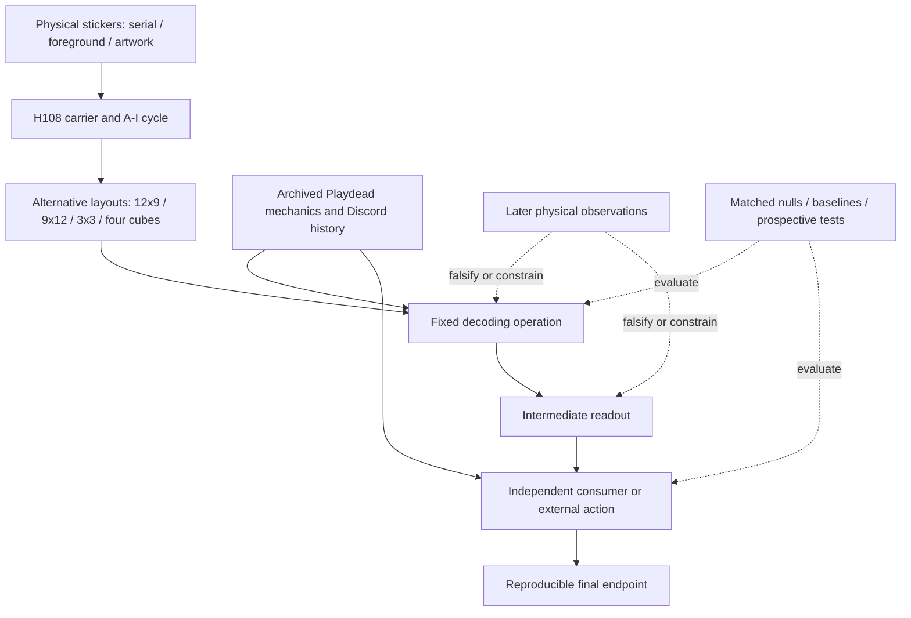
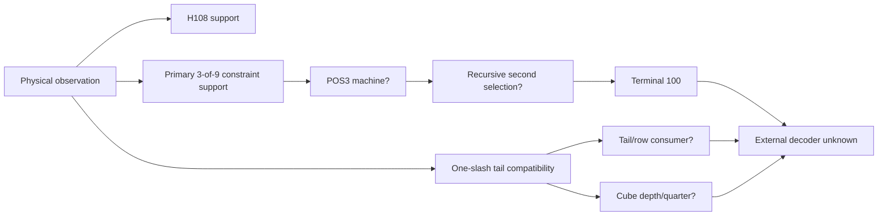

# INSIDE Sticker Experiments: Conceptual Map

**Research map v2 · 8 October 2026.** This page explains the *architecture of the evidence*, not just which experiments share keywords. Its companion [hypothesis-by-test matrix](hypothesis-test-coverage-matrix.md) and [32 curated evidence cards](evidence-register-view.md) link evaluations to source reports and their limits. The [complete 422-title index](experiment-title-index.md) (through main Experiment 423; 341 missing) is preserved *without* speculative auto-assigned topic tags.

## What needed fixing in v1

Version 1 had a useful chronology and pipeline but an overgrown 13×8 cross-family grid with cells that sometimes mixed direct tests, model fit, historical precedent and speculative output. Its keyword-tagged 422-row tail created apparent classification precision not justified by reading each underlying report. It also put **H108 periodicity** and **23-based print endpoints** beside **recursive decoding** as though all were alternative mechanisms, and it put **potential endgame outputs** in the same row dimension as decoder grammars.

Version 2 separates **observed carrier**, **candidate operation**, **consumer**, and **evidence design**. A dedicated register captures sources, frozen status and dependence clusters instead of placing many unrelated experiment IDs into a single visual cell. Counts describe the **extent of mapped work**, not the probability a decoder is intended. The terminology follows the repository's [epistemic-reset protocol](sticker-epistemic-reset.md).

## Theory and evidence are different directed graphs

This is a **pipeline of questions**, not an established sequence of authorial steps. Some theories skip readouts or consumers; others combine layers in ways the present evidence does not force.

**Do not read branches as independent evidence votes.** A later theorem conditional on POS3 and recursion is not another observation favoring them. A numerically elegant endpoint or geometric representation still needs a source-provided decoder/reader.

## How the full experiment history fits

| Era / experiments | Dominant research activity | Methodological interpretation | Current destination |
|---|---|---|---|
| **1–72** | Basic serial repeats, H108, images/bitmap, Braille, one-hot patterns, Q4, early pointers and erasure | Broad discovery; candidate definitions often retrospective | Repeated/registered carrier survives |
| **73–148** | Registration, selectors, routing normal forms, terminal and pointer machinery | Detailed conditional model construction | Mathematical model, no externally decoded endgame |
| **149–240** | Formal transducers, model inversions, hidden registers, physical provenance, proof/MDL | Internal consistency and conditional uniqueness | Useful exact constraints; need independent consumer |
| **241–296** | Raw-space reconstruction, gauge and symmetry, geometry and input operations | Alternative operation families tested, some selections depend on route preservation | Record gauges and violated conditions |
| **297–314** | Discord provenance, 108/9 chronology, row tools, local/global affine/permutation hostile tests | Distinguishes community-established carrier from post hoc machinery | Observational and historical priors |
| **315–359** | Explicit reset, 9+3, 9×12, Pigpen, row-selector rivals and nulls, perimeter | Much-needed negative controls, selection-aware correction | Frozen physical discriminators |
| **360–406** | Cross-puzzle acorn/ Xbox reconstruction, external 534brn, weighted ensembles, Morse/Trifid | Tests whether other puzzles provide an operation *and* a fixed registration | Cheap direct ciphers bounded; external link conditional |
| **407–423** | Cover/XOR/JPEG, physical 427 and 043, exact repeat audit | New actual observations prune old model universes and falsify a frozen E2 pair | Continued symbolic uncertainty |
| **Open PR #140–144** | IBM 029 punch conversion, 23 endpoints, cube null/correlations, destination-first portfolio | Unmerged reports, results not certified by this overview | Pending review and reconciliation |

**Main ledger count:** 422 indexed IDs because 341 is absent. This does not establish what happened on every closed/orphaned PR. Experiments 424/426/448–456 in open PRs must not be silently folded into main; [PR overlay below](#open-pr-overlay).

## Branches, grouped by causal role

| Facet | Research families / common hypotheses | Important discriminators and traps |
|---|---|---|
| **Carrier and provenance** | H108; print master; A–I artwork; serial phase; H108 endpoint alternatives | Exp 297, 301, 418, 420–421. Period replication is empirical; print total isn't |
| **Representation** | 12×9, 9×12, twelve 3×3 images, nine class words, 4×27, 3D cubes | Exp 18, 315, 326, 348, 373. A reshaping is not independently informative without a consumer |
| **Local code grammar** | 3/6 census, one-minority-per-column, literal Pigpen, ternary codebook | Exp 327–328, 349–352. Some support for occupancy, but codebook and semantics separate |
| **First-stage selector** | One-slash tail; row/chunk or column selection; digit-as-index | Exp 317–340, 373, 378. Selection-aware nulls mandatory |
| **Recursive machine** | POS3 Q4 selection reused, q routing, canonical terminal 100, gauges | Exp 96–172, 194–314, 353–359. Exact internal derivation does not independently identify intended operation |
| **Spatial or image rearrangement** | Row/column shifting, image continuity, mosaic/perimeter marks, overlays/XOR | Exp 298, 344–347, 360–364, 419. Generic visual optimizers fail; specific source cue could revive |
| **Standard cipher conversion** | Braille, Morse, Trifid, Fractionated Morse, Pigpen, Hollerith | Exp 13, 62, 327–335, 394, 402–405; PR #140. Many exact cheap families fail or merely re-encode data |
| **External game/ARG consumer** | Lever, Xbox digits, 534brn keypad, cover, Terminal 41, pointer/URL | Exp 342–343, 368–391, 408–417, 418. Proven operation family does not select exact CE parameters |
| **Completion and prediction** | U2/U3/U4/U5, erasure, 14-state incumbent, later 10-state surviving U5, frozen physical residues | Exp 72, 170, 365–367, 407, 418, 422; PR #143. Completion counts are grammar-relative |
| **Possible final payload** | Word, phrase, image, coordinates, password, path, in-game input, physical interaction | Exp 3, 57–68, 113–122, 240; PR #144. No validated downstream reader |

## Priority questions inferred from the map

**The next valuable advance is a new *discriminator*, not another internal model proof.**

- **New independent physical observation:** Preserve all frozen mutually opposed predictions, especially 50/54/93 in PR #143, row-family 84/102, and the U4/U5 fork at 82. Compare against current physical known/unknown mask when a new sticker emerges. Never retune a losing model.
- **Cross-family matched study:** Match the same test residues, scoring and null across tail-only, recursive, geometric, cube and simple majority baselines. Document model-selection chronology and abstentions explicitly. Check every family's prediction domain before comparing.
- **External-reader recovery:** An archival source that fixes *both* operation and its parameters could resolve more uncertainty than another million candidate completions. Separate operations used elsewhere from what is licensed *on the sticker object*.
- **Explicit stopping boundary:** Reproducible terminal 100, a pictorial surface or a punched-card pattern is an intermediate until someone can prove what it directs them to do. Do not optimize for English text or attractive imagery.
- **Source audit expansion:** 422 title entries are indexed; **32 decision-relevant claim records** are currently curated, not an exhaustive per-report content review. Gradually deepen the register by source audit instead of expanding keyword labels.

## Dependency and correction landmarks

1. **Repeat observations vs decoder:** Exp 421's H108 null is conditional on symbol counts; it does not create a blind period-search p-value or test POS3.
2. **Post-selection false validation:** Exp 329–340's row-one-exception branch: 4/4 forced leave-one-out correctness was guaranteed by the full-corpus model selection. Its frozen new-residue predictions remain useful.
3. **Model-relative equivalence:** Exp 286 explicitly superseded; 287–312 show substantial gauge/permutation freedoms and that terminal agreement alone is not operation identification.
4. **A sharp actual rejection:** Exp 390–391 produced a frozen E2 pairing from an external nine-digit interpretation; Exp 418's owner-confirmed 427=dot contradicted predicted 103=slash. Keep the failure visible.
5. **Negative tests have boundaries:** Literal Pigpen ink, standard direct Morse, unconstrained continuity sorting, grayscale photo edges and simple tail-XOR are bounded failures, never universal prohibitions against glyph, spatial or layered puzzle designs.
6. **Archive and source bytes:** Exp 316/337/413–417/423 reflect damaged 534brn captures, physical versus inferred JPEG structure and loss-map handling; never promote reconstructed pixels into direct evidence.

## Open PR overlay

| PR | Tentative contribution | Provenance condition |
|---|---|---|
| [#140](https://github.com/gamesbyian/GRA-EDISNI/pull/140) | 424, IBM 029 conversion | Fixed binary holes are a reversible encoding, no identified punched-card consumer |
| [#141](https://github.com/gamesbyian/GRA-EDISNI/pull/141) | 426, 23-aware endpoint totals | Arithmetic is not manufacturing evidence |
| [#142](https://github.com/gamesbyian/GRA-EDISNI/pull/142) | 448–449, four-cube depth null/readout | Compatibility may be common under matched census |
| [#143](https://github.com/gamesbyian/GRA-EDISNI/pull/143) | 450–456, cube completion, transfer holdouts, distinct depth/quarter predictions | Conditional model sets; new symbols 50/54/93 have high value |
| [#144](https://github.com/gamesbyian/GRA-EDISNI/pull/144) | Alternative destination hypotheses and source inventory | Endgame possibilities are a portfolio, not a solution |

**Maintenance:** Use the [method and dictionary](evidence-map-method.md); append sourced rows to [the register](../data/sticker-evidence-register.csv), review [the coverage matrix](hypothesis-test-coverage-matrix.md), and run `python scripts/check_evidence_map.py`. The title index is a historical navigation convenience, not a second canonical ledger.
