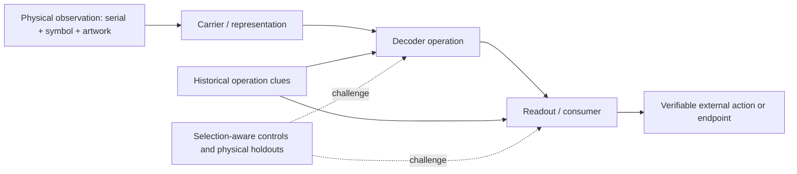

# Hypothesis-by-Test Evidence and Gap Map

**Revision 2: 2026-10-08.** Curated **36 claim-level evaluations** (not 36 independent tests), against **10 decoder operation families**, with BASE reserved for shared carrier/background or historical context. Research protocol and appraisal: [evidence-map method](evidence-map-method.md). Inspect each claim's source, corpus, dependence and limitation in the [evidence register](evidence-register-view.md), with [machine-readable CSV](../data/sticker-evidence-register.csv). Full historical IDs remain accessible via the [title index](experiment-title-index.md).

**This is an evidence *availability* map, not a scoreboard.** A cell says which focused evaluation exists; it does not assign a probability that its family is true. An empty cell means no qualifying evaluation **in this curated pilot**, not proof that nobody tested anything in the 452-entry historical ledger. Merged reports are available, but their model assumptions and retrospective selection remain provisional interpretations. The output of a cipher may be a command, image, address, URL, credential or other artifact; no format is presumed.

## Ontology: separate things that should never compete as equivalent hypotheses

**Carrier facts:** H108, the A–I phase and 81/27 split are common input constraints, **not decoding alternatives**. See [R001](evidence-register-view.md#r001), [R002](evidence-register-view.md#r002) and [R011](evidence-register-view.md#r011).

**Operations:** Codes below classify the **first discriminating operation**, not the final alleged plaintext. A full theory may combine several operations; such composites need additional records to make their decision points auditable. BASE deliberately remains outside this table.

**Consumers:** Known bunker lever, 534brn digit artifact, terminal 100, imagery, and future physical/in-game actions are **possible targets or intermediates**, not separate mutually exclusive code families merely because they have different appearances.

## Map A: mechanism × evaluation design

| Primary operation | Fixed raw-data fit / structural test | Null / baseline / competing specification | Same-corpus held-out or retrospective prediction | New physical validation | Independently registered consumer | Validated endgame |
|---|---|---|---|---|---|---|
| **ORDER:** row/column shifting and sorting | [R013](evidence-register-view.md#r013) | [R013](evidence-register-view.md#r013) [R014](evidence-register-view.md#r014) | [R013](evidence-register-view.md#r013) | *not mapped* | *not mapped* | **none** |
| **GEOMETRY:** 3×3 marks / glyph mapping, Pigpen | [R012](evidence-register-view.md#r012) [R015](evidence-register-view.md#r015) | [R016](evidence-register-view.md#r016) | *not mapped* | *not mapped* | *not mapped* | **none** |
| **TAIL:** one-of-three index and selected line | [R003](evidence-register-view.md#r003) [R004](evidence-register-view.md#r004) | [R005](evidence-register-view.md#r005) [R006](evidence-register-view.md#r006) | [R006](evidence-register-view.md#r006) [R008](evidence-register-view.md#r008) | *frozen 84/102 still untested* | *not mapped* | **none** |
| **RECURSIVE:** POS3, repeated selector, routing | [R009](evidence-register-view.md#r009) [R010](evidence-register-view.md#r010) | [R007](evidence-register-view.md#r007) [R011](evidence-register-view.md#r011) | [R007](evidence-register-view.md#r007) | [R011](evidence-register-view.md#r011) (conditional pruning) | *terminal 100 is internal; no external reader* | **none** |
| **CONVENTIONAL:** Trifid/Morse direct decoding | [R018](evidence-register-view.md#r018) [R019](evidence-register-view.md#r019) [R020](evidence-register-view.md#r020) (bounded failures) | *exact ensembles conditioned on U2* | *not mapped* | *not mapped* | *no successful consumer* | **none** |
| **DIGIT:** external indexed 534brn lookup | [R021](evidence-register-view.md#r021) | [R021](evidence-register-view.md#r021) | [R021](evidence-register-view.md#r021) | [R022](evidence-register-view.md#r022) **falsifies frozen E2** | Source artifact exists; CE registration incomplete | **none** |
| **LEVER:** symbol-to-direction command | [R023](evidence-register-view.md#r023) (fixed failure) | *not mapped* | *not mapped* | *not mapped* | Known bunker password fails direct registration | **none** |
| **OVERLAY:** perimeter marks, XOR and cover | [R017](evidence-register-view.md#r017) [R024](evidence-register-view.md#r024) | [R017](evidence-register-view.md#r017) | *not mapped* | *not mapped* | *no externally fixed overlay registration* | **none** |
| **CUBE:** physical-coordinate transfer, depth/quarter | [R026](evidence-register-view.md#r026) [R027](evidence-register-view.md#r027) (merged conditional) | [R028](evidence-register-view.md#r028) (merged conditional) | [R028](evidence-register-view.md#r028) **merged, conditional** | *opposing 50/54/93 untested* | [R029](evidence-register-view.md#r029) **conditional rival interpretations** | **none** |
| **PUNCH:** literal IBM 029 conversion | [R030](evidence-register-view.md#r030) **merged, conditional** | *information-neutral encoding* | *not mapped* | *not mapped* | *no source-fixed punched-card reader* | **none** |

[**R033**](evidence-register-view.md#r033) adds a same-support comparison of shifted versus exact physical cube coordinates. [**R034**](evidence-register-view.md#r034) is a **cross-family evaluation method**, not an eleventh decoder. It freezes each family's allowed symbols on the identical 42-residue unknown mask; [Experiment 458](experiment-458-common-mask-prospective-discrimination.md) records four more structurally consequential residue targets, **50/54/93/102**, and eight additional weak-copy-only disagreements. This study is an atlas of *future falsification opportunities*, never an independent same-corpus model-selection score.

**Warning about the column “new physical validation”:** R011 shows that sticker 427 supplied genuinely new observation and pruned *conditional* machine completions, but does not establish that recursion was intended. R022 is the more decisive test: a physically new symbol **contradicted a pre-frozen prediction**. Calling every same-corpus forced prediction “validated” would obliterate this distinction.

**Context outside the decoder contest:** [R025](evidence-register-view.md#r025) records an Xbox positional-filter precedent without asserting sticker transfer; [R031](evidence-register-view.md#r031) records bounded 23/endpoint arithmetic without print-run evidence; [R032](evidence-register-view.md#r032) records the endgame destination portfolio without validating a consumer. These belong in the background and output facets, not additional decoder rows.

**New source-provenance qualification:** [R035](evidence-register-view.md#r035) / [Experiment 465](experiment-465-background-url-discovery-provenance.md) establishes that the nine-piece *background* URL was **partially read before** the exact `dat/534brn...` path was reportedly found by inspecting a site index on 21 April 2020. The background-to-page relationship is a credible historical match but is **not a documented 21/21 independently blind decode**; its recognition does not fix any foreground-to-page consumer. This illustrates exactly why “external confirmation”, “independent derivation”, and “authorial operation cue” need distinct edges in this matrix.

**New linked retrieval control:** [R036](evidence-register-view.md#r036) / [Experiment 466](experiment-466-background-route-lookup-control.md) tests partial background artwork readings against **74 retrospectively preserved** Terminal41 routes. The recognized true URL is uniquely nearest for each (4 vs 17; 3 vs 15; 2 vs 15 edits). This is **retrospective source-assisted lookup** conditional on an answer-containing 2026 dictionary, not a blind decode or a foreground consumer. Its evidence is correlated with R035; do not count twice.

## Map B: high-value tests that genuinely distinguish alternatives

| Test/comparison | Actual observation | Degree of discrimination | Residual uncertainty |
|---|---|---|---|
| H108 vs accidental collision, common to all | [R001](evidence-register-view.md#r001): 20/20 within-period pair agreement | **Strong carrier support**, independent of downstream model | Period null is conditional; mechanism still unknown |
| Tail-only vs recursive model on same Q4 mask | [R006](evidence-register-view.md#r006) vs [R007](evidence-register-view.md#r007): 3/11 versus 10/11 forced; neither excludes truths | More constrained *conditional* incumbent fit | Model selected with same dataset; no prospective decisive win |
| Row-selector discovery and subsequent LOO | [R004](evidence-register-view.md#r004), corrected by [R005](evidence-register-view.md#r005) | Apparent 4/4 success is **guaranteed by model selection** | Only pre-frozen 84/102 can meaningfully challenge |
| Generic image continuity vs real acorn ordering | [R013](evidence-register-view.md#r013), [R014](evidence-register-view.md#r014) | Fixed image-smoothness maximization fails even a positive-control reconstruction | External ordering cue could rescue narrower picture family |
| Direct Pigpen strokes vs observed symbol families | [R015](evidence-register-view.md#r015); broad glyph flexibility [R016](evidence-register-view.md#r016) | Literal dual-stroke Pigpen rejected | Generalized glyph/category mapping remains underidentified |
| Direct unkeyed conventional cipher families | [R018](evidence-register-view.md#r018), [R019](evidence-register-view.md#r019), [R020](evidence-register-view.md#r020) | Frozen inexpensive registrations fail over conditional ensembles | A separately licensed key/grouping is a new test, not old failure overturned |
| Frozen 534brn E2 vs new owner observation | [R021](evidence-register-view.md#r021) → [R022](evidence-register-view.md#r022): 103 slash predicted, dot observed | **Real prospective falsification of E2** | Digit-based mechanisms generally remain open |
| Q4 depth vs quarter selected cube family | [R029](evidence-register-view.md#r029), merged #143 | Distinct conditional predictions 50/54/93 | Neither operation independently licensed; fresh residues needed |
| Punch-card conversion vs independently informative decoder | [R030](evidence-register-view.md#r030), merged #140 | Re-encoding is information-neutral | Source-specified hole reading could add an independent operation |

## Map C: missing *evidence*, not more experiments of the same sort

| Gap class | Current instance | A worthwhile next step | Gate that prevents unbounded search |
|---|---|---|---|
| **G1. Missing observation** | 50/54/93 cube fork; 84/102 row family; 82 U4-vs-U5 | Preserve opposing signed, **pre-frozen** predictions and verify a new physical serial in those classes | Do not re-fit on new sticker after prediction |
| **G2. Test exists but not independent** | Tail one-exception 4/4 LOO; recursive route uniqueness | Same-mask cross-family holdouts with nested selection correction or *new* physical observations | Same-corpus confidence must stay conditional |
| **G3. Test exists but is nondiscriminating** | XOR surface, shape re-encodings, alternate display layouts | Seek a decoder with an externally specified consumption rule, not more pretty intermediate surfaces | Reader must be fixed before inspecting candidate outputs |
| **G4. Missing registration or physical cue** | 534brn orientation, overlay layer, 3D cube mapping, Pigpen book | Recover contemporaneous source establishing exact parameters | “Playdead did something similar” licenses operation class, not parameters |
| **G5. Missing endgame validation** | All ten mechanism families | Find an independently checkable next interaction / password / URL / executable operation | Explicit success criterion and reproducible end-to-end chain |
| **G6. Incomplete evidence appraisal** | Hundreds of older ledger titles not in 36-record curated register | Promote material experiments after reading original report+script, no forced one-to-one title tagging | Report coverage denominator and review status separately |
| **G7. Already bounded negatives** | Direct Morse/Trifid, literal Pigpen, generic continuity sorting | Reopen only with a precise independent cue or newly relevant data | Old negative scoped to its fixed parameter family |

## Decision rules for the next research pass

1. **Construct comparable units first.** Set the same physical residue holdout set, time-of-freeze rule, unknown mask, and historical input snapshot. Tail grammar cannot fairly be penalized for not predicting first-81 data it explicitly does not model.
2. **Report prediction coverage and error separately.** For each family: observations excluded, predicted singleton versus ambiguous count, forced correctness, *trivial majority baseline* and selection-aware null; distinguish post-hoc leave-one-out from true new-observation checks.
3. **Preserve an operation/parameter ledger.** A searched cube rotation, Q relabeling or Pigpen glyph orientation is fitted until a prior artifact specifies it. If trying multiple interpretations, retain the whole plausible multiverse and its failures.
4. **Maintain one dependency cluster per source selection episode.** Ten experiments on the same residuals are ten analyses, not ten independent physical replications.
5. **Refuse semantic fishing.** No image similarity, letter resemblance, 23 arithmetic, or terminal-byte analogy becomes a candidate winner without an independently justified reader and a frozen, falsifiable next action.

The comprehensive historical title index is still available, but **the curated register does not assert that all 452 original full reports were audited**. Method and update rules: [`docs/evidence-map-method.md`](evidence-map-method.md).
